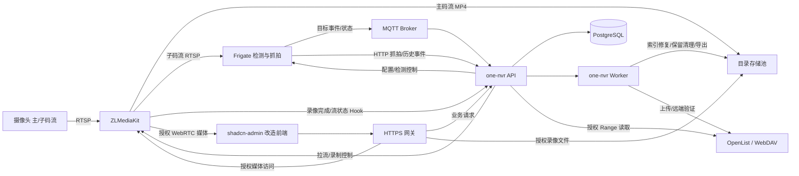
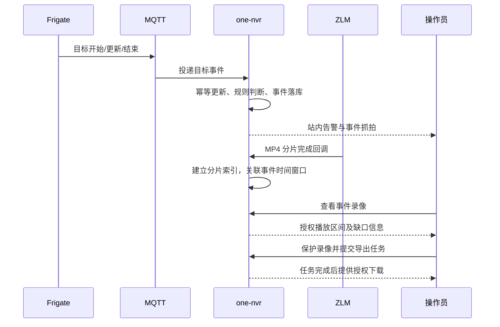

# one-nvr 产品需求文档

| 项目 | 内容 |
| --- | --- |
| 文档版本 | v0.15，开发评审稿 |
| 编写日期 | 2026-10-03 |
| 产品定位 | 单站点本地部署的视频监控、录像与智能事件管理系统 |
| 已确认规模 | 首版支持 16–32 个固定通道，每通道绑定一个当前视频源 |
| 固定技术约束 | ZLMediaKit（ZLM）取流与录制；Frigate 智能检测；自研控制面；直接改造 shadcn-admin 前端 |
| 本轮交付 | 产品范围、交互要求、集成边界、数据与接口需求、验收标准、版本路线 |
| 文档状态 | 需求草案已具备评审内容；性能指标是待实现、待实测的验收目标 |

变更记录：v0.2 按已确认要求改为通过已挂载目录添加多个存储池，统一调整写入分配、页面、数据模型、接口、容量口径与验收。

v0.3 参考 camera-recorder 的录像工作区、文件健康、删除语义、范围导出与 OpenList/WebDAV 归档管理；按用户确认将云归档和本地/云端统一回放纳入 P0。录像相关功能合并到一个“录像”一级入口。

v0.4 按用户要求增加手动上传、定时上传和云端最大保留期；云端自动到期清理纳入 P0，替代 v0.3 不自动删除远端的设计。明确到期计时、保护例外、删除重试与副本状态同步。

v0.5 按用户要求统一以目录作为存储池接口，移除 NAS 认证、RAID 与热备的交付和后续规划，以及底层挂载身份管理；保留目录读写、可用容量、业务媒体管理与异常处理。

v0.6 按用户要求改为固定通道管理，摄像头为通道的视频源配置；录像、回放、权限、规则、存储与云归档归属不可变通道 ID。增加源配置版本、切换回滚和来源追溯，替换视频源不重建通道或丢失历史。

v0.7 将视频源可用性、录像生成完整性和历史媒体可访问性纳入持续记录与 P0 可靠性评估；区分通道、摄像头来源身份与连接配置版本，补充指标口径、故障归因、历史趋势与统计验收。

v0.8 增加 AMD EPYC 7402 与 Intel N5105 的候选部署档案；独立配置视频解码和 AI 推理，补充硬件探测、配置验证、负载监测及分别认证录像/检测规模的要求。候选档案不代表已通过性能测试。

v0.9 明确首版单机 Linux + Docker Compose 部署，补充服务划分、硬件覆盖配置、目录映射与界面添加存储池的边界、持久化、入口及启动/恢复验收。

v0.10 明确 `.env` 只保存首次部署与容器启动参数，业务配置由界面管理；补充默认值、密钥文件、变量注入与变更生效边界。

v0.11 按用户要求支持管理员点击查看已保存的摄像头密码，以及一键导出包含后端解密凭据的通道视频源配置；同步调整原“保存后不回显”限制，区分该显式操作与默认脱敏、日志及系统备份。

v0.12 增加 P0 摄像头视频源配置批量导入，支持导出 JSON 回导和 CSV 模板，补充固定通道映射、预览校验、连接测试、逐项应用/回滚、任务恢复与凭据处理。

v0.13 按用户要求将摄像头导入/导出业务字段统一为 channel_no、channel_name、ip、rtsp_port、username、password、main_path、sub_path，系统生成 RTSP 地址；预留可选 onvif_port，后续 ONVIF 复用同一配置表和来源凭据。

v0.14 按用户确认将普通事件索引保留期设为 90 天；更早录像通过通道与时间检索，事件索引到期不删除录像或改变本地/云端期限，抓拍仍按独立媒体策略管理。

v0.15 提供首轮 M0 Compose 实验包与部署说明，包含 CPU/Intel 核显档案、ZLM 录制、Frigate 检测、SQLite 观察索引及 HTTPS 测试页；该原型不代表生产控制面完成或真机验收通过。

## 1. 产品目标与范围

one-nvr 面向门店、办公区、仓库和小型园区的本地监控场景，用一个 Web 控制面完成“接入摄像头 → 实时查看 → 自动录像 → 智能告警 → 检索回放 → 导出证据 → 运维排障”的闭环。

以海康 NVR 4.0 的常见业务能力作为功能参照，独立设计产品、接口和交互。海康不同型号的功能并不相同，本项目通过第 4 节的能力矩阵定义实际覆盖范围，不以“4.0”名称承诺所有硬件和智能能力。

### 1.1 已确认要求

1. 单站点、本地部署，支持 16–32 个通道，可接入对应规模摄像头。
2. 摄像头视频统一由 ZLM 拉取；正式录像统一由 ZLM 生成。
3. 智能检测采用 Frigate；one-nvr 整合事件、规则、抓拍与回放入口。
4. 控制面自研，用户在 one-nvr 内完成日常业务。
5. 前端直接基于 [satnaing/shadcn-admin](https://github.com/satnaing/shadcn-admin) 修改，保留其布局、组件体系和工程基础。
6. 存储采用添加存储池的方式，一个运行环境可访问的目录对应一个存储池；目录由部署环境提供，one-nvr 管理目录内的录像及相关媒体。
7. 参考 [zhigu34/camera-recorder](https://github.com/zhigu34/camera-recorder) 的录像文件管理，并包含 OpenList/WebDAV 云归档，统一管理本地与云端录像。
8. 云归档支持手动和定时上传，可设置云端最大保存时限，例如保存一年，超过期限自动删除云端副本以释放空间。
9. 存储池只面向已可访问的目录；NAS、RAID、热备及其他底层实现不属于 one-nvr 的产品功能、适配认证或版本规划。
10. 采用类似 NVR 的固定通道管理：可修改或更换通道绑定的摄像头配置，保持原通道录像策略、历史录像和回放入口，不把摄像头设备作为录像归属主键。
11. 持续记录摄像头视频源可用性、录像完整性、故障与恢复，用于评估设备可靠性；统计保留更换前后的来源区分，不能只展示当前在线状态。
12. 已有 AMD EPYC 7402 与 Intel N5105 两种部署机器；内存、独显、操作系统及虚拟化/直通条件待确认，先按候选档案验证实际能力。
13. 普通事件索引保存 90 天；更早录像只需按通道和时间检索，不要求继续支持人车/区域事件检索。

### 1.2 本稿采用的产品假设

这些是初始设计基线，不是用户额外提出的约束；评审时可调整。

| 维度 | 初始基线 |
| --- | --- |
| 生产环境 | Linux x86_64，Docker Compose；开发环境可用 macOS |
| 摄像头 | 首版以 RTSP 摄像头为主，支持主码流与子码流 |
| 首版浏览器 | 桌面 Chrome、Edge 当前稳定版及前一主要版本；冻结版本时记录兼容矩阵 |
| 首版视频编码 | H.264 完整预览、录像和回放；H.265 允许原码录像，浏览器播放按能力判断 |
| 默认录像方式 | 24 小时连续录像，可配置每周计划 |
| 默认保留期 | 普通本地录像 7 天，包含手动模式下未选中上传的录像；要求归档的本地源默认保留 48 小时，期满且成功验证未到期的云副本后才可自动清理本地，整体到期规则另见 ARC-09 |
| 存储模型 | 支持添加多个目录存储池；一个默认池，每个通道明确绑定一个写入池；只依赖目录接口，不区分底层实现 |
| 通道模型 | 初始化选择 16 或 32 个固定槽位，显示 CH01…CH16/CH32；每个通道有不可变 ID，视频源可为空或替换；16 扩至 32 只追加槽位 |
| 可靠性记录 | P0 按通道与 source_id 统计视频源可用性、录像有效覆盖和故障；修改连接配置保留同源统计，换设备建立新源身份 |
| 云归档 | P0 可选启用 OpenList/标准 WebDAV；支持手动、定时、立即上传；未配置时不影响本地监控与录像 |
| 云端保留期 | 启用归档默认 365 天，可调整正整数天数；本稿“一年”按 365 天计，从录像实际结束时间计算，保护和有效任务引用可延后删除 |
| 身份体系 | 本地账号，管理员、操作员、查看者，按通道授权 |
| 默认语言与时区 | 简体中文，Asia/Shanghai；存储时间统一 UTC |
| 云依赖 | 已准备镜像、模型与依赖后，本地监控与录像可离线运行；云归档/云端回放需要对应服务和网络 |
| 后端建议 | Go 模块化服务、PostgreSQL、独立任务 worker、Mosquitto MQTT |

### 1.3 首版成功标准

- 管理员可在 10 分钟内完成首次部署向导，并接入第一台已知 RTSP 地址的摄像头；镜像下载和硬件安装不计入。
- 正常网络下，用户能在同一界面查看多路画面、找到指定时间录像、按人车事件检索并导出证据。
- 本地副本已清理但云端副本可用时，同一录像仍可检索和回放；上传或云端服务异常不停止本地录制。
- CH01 更换摄像头或修改连接配置后，仍按 CH01 检索更换前后的录像，沿用录像/存储/权限/归档策略，历史回放不依赖旧摄像头在线。
- Frigate 停止或智能配置失败时，ZLM 的既有连续录像仍继续。
- 无人观看、用户退出、前端关闭时，既有录像计划仍正常执行。
- 视频缺失、检测不可用、磁盘异常都有明确状态，不能用“运行中”掩盖故障。
- 用户能查看最近 24 小时/7 天/30 天及自定义时段的可用率、应录/有效录像时长、缺口、故障与恢复，并区分设备来源问题、录像链路问题和监测未知。
- 16 路标准档与 32 路扩展档分别通过第 13、16 节的实测验收，才能对外声明支持对应规模。

## 2. 用户、场景与权限

### 2.1 用户角色

| 角色 | 主要任务 | 默认权限 |
| --- | --- | --- |
| 管理员 | 部署、接入设备、配置录像与智能规则、管理存储和账号 | 全站配置与业务权限，可授予通道范围 |
| 操作员 | 值守、处理事件、检索录像、导出和保护证据 | 授权通道的预览、回放、事件处理、导出、证据保护 |
| 查看者 | 日常查看画面与录像 | 授权通道的预览、回放、事件查看；默认无导出权限 |

仅管理员可以删除录像、解除证据保护、修改用户权限、添加/停用存储池与修改系统集成，以及查看摄像头密码/导出含凭据的视频源配置；后两者还须校验对应通道配置权限，录像导出权限不授予密码访问。新增用户默认无通道访问权限；配置管理权限不会自动授予未授权通道的视频访问权限。

### 2.2 核心使用场景

| 场景 | 用户故事 | 结果 |
| --- | --- | --- |
| 首次接入 | 管理员输入主/子 RTSP 地址和账号，测试后保存 | 画面可看，录像策略可选，故障原因可定位 |
| 实时值守 | 操作员把入口、走廊、仓库组成 9 宫格 | 画面和告警同时可见，异常通道有明显状态 |
| 夜间入侵 | 管理员对仓库禁入区配置人形进入与布防时间 | 满足规则后产生告警，可直接定位对应录像 |
| 事故取证 | 操作员根据通道和时间查找片段 | 剪辑导出、保护录像，并留下审计记录 |
| 更换摄像头 | 管理员在 CH01 中更新视频源，保留通道编号、名称与策略 | 新源按原策略继续录像，旧录像仍在同一通道时间轴，切换点与来源可追溯 |
| 设备故障 | 摄像头断网或硬盘写入失败 | 故障可见、通知去重、恢复后自动继续业务 |
| 可靠性评估 | 管理员比较 CH01 的 A/B 摄像头及同一设备多个配置版本的历史 | 可用率、断流次数/时长、录像覆盖和已确认原因可追溯；不把存储故障直接归责摄像头 |
| 交接班 | 操作员标记事件处理结果并备注 | 下一位操作员能查看处理人、时间与证据 |

## 3. 产品分期与方案选择

### 3.1 集成方案比较

| 方案 | 优点 | 代价 | 结论 |
| --- | --- | --- | --- |
| 自研控制面统一编排 ZLM 与 Frigate | 统一权限、录像策略、事件、操作体验；职责符合指定技术栈 | 需要开发录像索引、回放编排、配置发布和可靠性处理 | 采用 |
| 前端聚合或嵌入两个组件的原生管理页面 | 原型较快 | 账号与权限分散，录像来源和保留策略容易冲突 | 不作为正式产品方案 |
| 深度修改 Frigate 内部录像与数据库 | 可复用部分内部工作流 | 升级成本高，耦合录制和检测，改变指定分工 | 不采用 |

### 3.2 版本定义

| 阶段 | 目标 | 主要交付 |
| --- | --- | --- |
| M0 集成验证 | 验证关键链路是否满足分工 | 2 路真机，ZLM 录制、Frigate 检测、事件关联录像、浏览器播放、重启恢复 |
| V1.0 / P0 | 可用于单站点日常监控 | 固定通道与视频源配置/更换、多画面、录像工作区、录像文件管理、本地/云端单路回放、OpenList/WebDAV 归档、人车与区域规则、事件处理、导出、权限、存储、可靠性历史和运维 |
| V1.1 / P1 | 完善传统 NVR 操作体验 | ONVIF 发现与 PTZ、4 路同步回放、智能跳播、事件保留模式、邮件通知、手机体验 |
| V2 / P2 | 增强智能与扩展能力 | 人脸、车牌、越界与计数验证、高级业务统计报表、跨站点、GB28181 接入、外部报警设备适配 |

P0 表示 V1.0 发布必需，P1/P2 不计入首版验收。首版必须闭环交付，不能只展示模拟页面或跳转到 Frigate/ZLM 原生页面代替功能。

## 4. 海康 NVR 4.0 能力对照

| 参考能力 | one-nvr 交付要求 | 分期 | 承担组件与边界 |
| --- | --- | --- | --- |
| 摄像头接入、主/子码流管理 | 固定通道内配置/更换 RTSP 源、测试、分组、启停与状态 | P0 | one-nvr 通道管理 + ZLM；ONVIF 自动发现 P1 |
| 多画面实时预览 | 1/4/9/16 分屏、全屏、保存视图、子码流优先 | P0 | 自研播放器 + ZLM |
| 连续、计划、手动录像 | 配置计划并由后台持续执行 | P0 | one-nvr 调度 + ZLM MP4 |
| 按时间查找与普通回放 | 日历、时间轴、跳转、倍速、跨分片播放 | P0 | 自研索引与播放器 |
| 即时回放 | 从预览跳到最近已完成的录像 | P0 | 显示最近可用边界；正在写入的片段需等待完成 |
| 多路同步回放、智能回放 | 4 路共用时钟、事件区间跳播 | P1 | 自研回放编排；不同步或无录像须可见 |
| 人形、车辆目标检测 | 对模型支持的目标分类、过滤与检索 | P0 | Frigate；不能等同于身份识别 |
| 区域进入、停留告警 | 多边形区域、目标类别、布防计划、冷却 | P0 | Frigate zones + one-nvr 规则 |
| 定向越界、人数统计、热力图 | 分别验证轨迹输入、去重和统计口径后开放 | P2 | 原生 zone 进入不等同于定向越界或精确人数统计 |
| 人脸识别、人员检索 | 可选能力、人员库与权限、身份事件检索 | P2 | Frigate 支持版本的识别能力；以图搜人另行验证 |
| 车牌识别、车辆检索 | 车牌结果筛选、人工确认、名单管理 | P2 | Frigate 支持版本的 LPR；国内车牌适配需样本验收 |
| 报警联动 | 站内通知与通用 Webhook；邮件 P1 | P0/P1 | one-nvr 规则与任务；物理 I/O P2 |
| 剪辑导出、录像加锁 | MP4 导出、证据保护、下载审计 | P0 | one-nvr worker；源录像来自 ZLM |
| 云归档与副本管理 | OpenList/WebDAV 手动/定时/立即上传、验证、本地/云端统一回放、超期删除 | P0 | camera-recorder 参考行为与 one-nvr 新增保留策略；不据此宣称是海康所有 NVR 4.0 的原生能力 |
| 存储池与保留管理 | 添加可访问目录、通道分配、容量、天数、配额、水位、循环清理 | P0 | one-nvr 管理目录存储池；ZLM 录制到选定池 |
| NAS、RAID、热备等底层存储 | 统一提供可访问目录后作为存储池使用 | 不纳入版本规划 | 不识别、配置、管理或认证底层存储实现；只检查目录接口与实际媒体操作结果 |
| 远程查看 | 浏览器通过受控 HTTPS 入口访问 | P0 | 本地网络或已有 VPN；公网穿透与云账号 P2 |
| 系统与用户管理 | 本地账号、通道权限、审计、状态、配置备份 | P0 | 自研控制面 |
| 通道/视频源可靠性评估 | 可用性区间、断流与恢复、应录/有效覆盖、原因和趋势 | P0 | one-nvr 持续采样、媒体校验与历史汇总；摄像头物理故障须有证据归因 |
| 摄像头升级、参数批量配置 | 按厂商/协议能力适配 | P2 | RTSP 接入本身不提供固件升级能力 |
| PoE、HDMI 输出、双向语音 | 由硬件或后续适配提供 | 不属于 P0 | 首版是 Web NVR，不承诺录像机硬件接口能力 |

海康参考范围来自其 [NVR 官方课程](https://hsrc.hikvision.com/europe/support/academy/online-courses/network-video-recorders/)；本表的 one-nvr 实现与分期是产品设计要求。

## 5. 总体架构与职责

### 5.1 架构图



WebRTC 信令通过受控入口，媒体可直接与 ZLM 协商；这条媒体通路仍须会话授权。图中的“正式录像存储”不是公开目录，网关先校验用户和通道权限，再交付文件。

### 5.2 组件边界

| 组件 | 负责 | 接入原则 |
| --- | --- | --- |
| one-nvr Web | 页面、交互、播放器、区域绘制、状态展示 | 只调用 one-nvr 业务接口，不携带上游管理密钥 |
| one-nvr API | 固定通道、视频源配置、权限、规则、录像索引与副本、事件、播放会话 | 媒体归属通道；同一录像 ID 可解析本地或云端来源 |
| one-nvr Worker | 计划调度、健康观测/可靠性汇总、状态对账、抓拍归档、上传/验证、导出、清理、通知 | 任务可重试、幂等、可观测，上传或健康统计失败不阻断录像 |
| ZLM | 拉流、协议转换、分发、MP4 录制 | 既有流与录像不依赖前端在线 |
| Frigate | 视频解码、目标检测/跟踪、区域结果、抓拍 | 关闭正式录像；检测输入来自 ZLM |
| MQTT | Frigate 事件与状态传递 | 私有网络、账号 ACL；不假设天然可靠或完整回放 |
| PostgreSQL | 配置、账号、事件、分片索引、健康区间/统计、任务与审计 | 不存放视频二进制 |
| HTTPS 网关 | TLS、业务入口、受保护文件交付 | 禁止透传上游管理入口和公开目录列表 |
| OpenList / WebDAV | 可选远端录像归档与读取 | one-nvr 只依赖 WebDAV；实际云盘/对象存储驱动由 OpenList 配置 |

ZLM 的拉流与录制 API 及完成回调分别见 [RESTful API](https://docs.zlmediakit.com/guide/media_server/restful_api.html) 和 [Web Hook](https://docs.zlmediakit.com/guide/media_server/web_hook_api.html)。这些是集成原语；计划、检索、权限和保留策略由 one-nvr 实现。

### 5.3 视频路径与所有权

1. 每个逻辑通道分配不可变 `channel_id` 和固定显示编号，摄像头作为可替换的源配置；通道主/子流业务入口稳定，内部流按源配置版本/运行代次区分，不能以当前设备地址作为历史关联键。
2. 主码流经 ZLM 原码录制；子码流经 ZLM 转发给 Frigate，并优先用于分屏预览。
3. 每个上游码流尽量只建立一条 ZLM 拉流连接；多个浏览器和检测消费者复用它。主、子码流是两条不同连接，不能声称一台摄像头始终只有一条连接。
4. 没有子码流时允许检测复用主码流，界面提示解码开销；不自动新增到摄像头的直连检测路径。
5. 正式录像由 ZLM 写入通道绑定存储池的录像子目录，分片索引保存原池引用。Frigate `record` 关闭，保留抓拍与检测必需数据；不从 Frigate recordings 或其原生 clip 接口获取录像。
6. Frigate 的 go2rtc 可按锁定版本需要保留，但不得成为摄像头取流和正式录像的第二入口。
7. FFmpeg 可用于导出拼接、媒体探测和明确启用的兼容转码；首版不以 FFmpeg 另起常驻录像任务替代 ZLM。
8. 每次视频源切换保留旧源版本和流会话映射；录像完成回调根据原流会话归属通道与源版本，不能因新配置已生效而将迟到文件标成新摄像头所录。

Frigate 的抓拍与录像独立配置和保留，见 [Snapshots](https://docs.frigate.video/configuration/snapshots/)。MQTT 目标事件可提供同一目标的开始、更新和结束消息，见 [MQTT 集成](https://docs.frigate.video/integrations/mqtt/)；关闭录像后的持久事件查询和恢复能力仍须通过 M0 实测。

### 5.4 浏览器播放兼容

- 直播优先 WebRTC；协商失败可尝试经验证的 HLS 兼容路径，并显示连接方式和实际延迟。
- H.264 是首版统一播放验收基线。ZLM 转协议不等于自动转码，H.265 能录制不代表任何浏览器都能播放。
- H.265 主码流搭配 H.264 子码流时，直播可走子码流，回放原码录像仍需单独检查能力。
- 不能播放时明确显示“当前编码不支持此浏览器”，提供下载或调整摄像头编码入口；不无限重连。
- P1 增加可选硬件转码通道，显示资源预算与并发限制，不默认对 32 路主码流全量转码。
- 声音默认关闭；仅单个选中画面可开音，音频不兼容时保持视频可用并提示。首版不承诺对讲。

## 6. 功能需求

### 6.1 首次部署与总览

| ID | 优先级 | 需求与验收行为 |
| --- | --- | --- |
| SET-01 | P0 | 首次启动创建管理员，设置站点名、时区，并通过可访问目录添加第一个默认存储池；完成前不开放匿名业务访问 |
| SET-02 | P0 | 检查 ZLM、Frigate、数据库、MQTT、磁盘写权限和可用空间；失败项有原因与处理入口 |
| SET-03 | P0 | 选择检测硬件配置，验证模型可加载；不满足条件可先启用录像，但检测显示未就绪 |
| DASH-01 | P0 | 总览展示通道在线数、录像正常数、检测正常数、未处理事件、各存储池可用空间与预计保留天数；共享同一文件系统的容量不重复累加 |
| DASH-02 | P0 | CPU、内存、GPU/检测器、网络与写入状态；未知指标显示未知，不能以 0 代替 |
| DASH-03 | P0 | 最近告警与失败任务可跳到对应通道、事件或诊断页 |
| DASH-04 | P0 | 展示选定时段的通道主流可用率、录像有效覆盖率、监测覆盖率与异常通道；可进入可靠性详情，未知/样本不足明确标记 |

### 6.2 通道管理与视频源配置

**CH-01 / P0：固定通道与配置。** 初始化生成 16/32 个通道槽位，编号 CH01…CH16/CH32 与 `channel_id` 固定，名称、分组可修改，未绑定视频源显示“未配置”。在通道内配置主 RTSP 地址、可选子 RTSP 地址、账号、密码和传输方式；录像、存储、检测和归档策略独立绑定通道。连接测试分别验证认证、视频轨道、编码、分辨率、帧率及首帧，不仅检查 TCP 端口。允许保存离线草稿，但不将未测试草稿自动替换正常运行的源。

**CH-02 / P0：通道列表。** 显示固定编号、通道名称、分组、当前视频源摘要、主/子流状态、录制状态、检测状态、最近错误、码率和更新时间；空槽位也展示。支持搜索、筛选、批量分组和策略分配；不得把拉流在线等同于录像成功。实时视图、录像日历、事件和权限均使用通道 ID，通道重命名不改变媒体位置或保存视图。

**CH-03 / P0：修改或更换视频源。** 通道详情包含基本信息、当前源、配置历史、录像、检测、区域、健康与审计。修改地址/凭据或更换摄像头形成新源配置版本，先使用临时测试流验证，测试阶段旧源按原策略继续录像；测试失败不应用。通道名/分组等业务信息修改不重建媒体流。

应用视频源时串行切换当前通道，完成/关闭旧源尾片，停止旧录制会话，启动新源并重新执行原通道期望录像策略；每个尾片保存真实媒体边界，不能把旧/新源拼成同一原始分片。新源首帧与新录制状态确认后标记生效，未在可配置超时内就绪则回滚旧版本并恢复原策略，回滚失败明确告警。切换任务持久化、幂等且同通道互斥，重启后对账实际生效源；其他通道不因该切换重建 ZLM 录制。新源启停造成的真实缺口可见，不承诺物理拔换设备或 RTSP 重连期间零丢帧。

**CH-04 / P0：启停与清空视频源。** 管理员可以禁用通道、关闭检测或关闭录像，三个操作独立；“清空视频源”停止当前源并将槽位变成未配置，保留编号、通道名称、策略、权限和历史媒体。首版不提供删除/重新编号固定通道或复用其 ID 为另一个逻辑通道；重新配置同一槽位继续沿用其历史。删除媒体是独立操作，不能由清空源或更换设备级联触发。

**CH-05 / P0：凭据保存与查看。** 摄像头密码在后端加密保存；通道视频源配置默认显示掩码，不把明文附带到普通列表/详情响应。管理员在有配置权限的通道点击“查看密码”时，后端校验当前权限、解密已保存凭据并返回，支持显示/隐藏与复制；隐藏、离开页面或退出登录后清除前端明文，不写入浏览器持久缓存。空密码、凭据未保存和解密失败分别显示，不能把掩码当成真实密码；管理员保存配置时“保留原密码”“清空密码”和“替换密码”明确区分。RTSP URL 中嵌入的凭据保存时提取并加密，普通展示脱敏。只能查看 one-nvr 已保存的密码，不承诺从摄像头读取未登记的原始密码。查看操作记录用户、通道/源版本、时间和结果，审计不含明文；日志、通知、普通页面及录像证据导出清单不携带凭据。

**CH-06 / P1：ONVIF。** 局域网发现、能力探测、配置 RTSP 地址、PTZ 方向/变焦/预置位；按钮按实际能力显示。摄像头厂商固件、时间和编码批量管理归 P2，不由 ONVIF 名称自动承诺。

**CH-07 / P0：历史归属与来源追溯。** 录像、事件、抓拍、缺口、导出和保护记录保存 `channel_id`；录像与事件另存产生时的源版本/运行代次及脱敏来源摘要。CH01 的摄像头 A 换成 B 后，A/B 录像在同一通道时间轴检索，可筛选源版本和查看切换标记；原录像不迁移、不改 ID、不重置保留截止时间，不取消已有上传/导出任务。回放和云端对象键不依赖当前视频源，清空源也可查看历史。

**CH-08 / P0：检测切换隔离。** 换源后使用新的检测运行代次，旧源活动目标与新源目标不合并；迟到 MQTT 消息和抓拍按原时间、源版本和运行映射关联，无法判断时标为来源不确定并进入对账，不能直接归到新源。区域/规则定义仍属于通道；更换设备、视角或画面比例变化时标记区域待校准，需校验后恢复受影响区域规则，基础检测与录像可继续。锁定版本若发布 Frigate 配置需整服务重启，明确展示检测影响范围，不能据此中断其他通道的 ZLM 录像。

**CH-09 / P0：视频源身份与配置版本分离。** `channel_id` 为业务归属，`source_id` 为用于评估的摄像头来源身份，`source_revision_id` 为连接配置版本。第一次配置源创建 source_id；“修改连接配置”沿用身份，修改 IP/密码/传输方式不重置累计可靠性；“更换摄像头”默认新建 source_id，也可明确选用已登记的历史来源以继续统计同一设备。来源身份维护在通道配置/历史内，不新增独立摄像头管理入口。IP、名称、RTSP URL 不自动等同于物理设备身份，设备序列号仅在可获取且核验后作辅助证据；来源未知或操作者未确认时标记身份不确定，不把两台设备合并评分。

**CH-10 / P0：一键导出视频源配置。** 通道管理支持单通道、勾选多通道及全部有权限通道的“导出摄像头配置”，导出当前生效源的版本化 JSON。业务字段采用 CH-11 的八列结构，可附带 onvif_port；站点/导出时间、通道 ID 和源 ID/版本作为追溯元信息，完整 RTSP 地址由结构字段生成，不要求导入者填写整条 URL。用户点击该明确入口后，后端授权并自动解密，导出文件可直接查看凭据，无需手动使用部署密钥解密；入口说明文件包含密码。未配置源标记未配置，无密码如实导出空值；任何需导出的凭据解密失败时返回对应错误，不生成看似完整的成功文件。完整 URL 形式的已有配置须可无损拆成共同 IP/端口/凭据与主/子路径；不可表达的源逐项报错，不静默改写地址或丢弃参数。导出不修改通道、录像、历史或源版本，不包含数据库/MQTT 密码、部署主密钥或其他通道凭据。响应与下载不缓存，避免生成长期公开链接或把明文文件持久存入普通录像导出历史；记录导出范围、操作者、时间和结果，不记录密码或文件正文。该入口与系统加密备份、录像 MP4/证据导出区分。

**CH-11 / P0：批量导入与预览。** 通道管理提供“导入摄像头配置”和下载 CSV 模板，支持 CH-10 导出的版本化 JSON 原样回导，以及 UTF-8 CSV；不要求将摄像头凭据重新用部署密钥加密。管理员上传后先解析、校验和预览，不立即修改运行配置。首版文件上限 1MiB、32 个通道条目，超限或不支持的格式/版本明确拒绝；CSV 使用正规解析器处理引号、逗号、换行和 UTF-8 BOM，不通过执行文件内容解析。预览按行显示目标通道、脱敏新旧差异、新增源/更新/跳过/冲突、凭据状态与错误，可选择应用哪些有效行。

| CSV 字段 | 规则 |
| --- | --- |
| `channel_no` | 可填 CH01…CH16/CH32，按当前站点已有槽位映射；为空时须在预览中指定目标或选择按编号顺序分配未配置槽位 |
| `channel_name` | 可选，默认不覆盖已有通道名称；管理员可在预览中选择导入名称 |
| `ip` | 已配置源必填，摄像头 IPv4/IPv6 地址，不含协议、端口、账号或路径 |
| `rtsp_port` | 正整数 1–65535，留空默认 554；与 IP 独立保存 |
| `username` | 需要认证时填写；账号缺失/空值的保留或清空意图在预览明确，与密码共同验证 |
| `password` | 已保存导出密码可直接使用；字段缺失表示保留已配置目标的密码，新源需填写或明确选择无密码；空字符串表示有意使用空密码，掩码不可作为有效密码 |
| `main_path` | 已配置源必填，直接填写 `/main` 等以单个 `/` 开头的路径，可包含实际码流 query 参数；不填写完整 RTSP URL |
| `sub_path` | 可选，如 `/sub`；留空表示没有独立子流，按 CH-01/5.3 的规则选择检测来源 |

基础 CSV 表头固定为 `channel_no,channel_name,ip,rtsp_port,username,password,main_path,sub_path`。RTSP 的 TCP/UDP 传输仍可在界面配置，八列模板不额外增加 transport 列；更新保留当前目标传输设置，新源默认 TCP。JSON 使用相同业务字段及可选追溯元信息，不能只支持 CSV 结构而继续要求 JSON 填完整 URL。

**CH-13 / P0：结构地址与 ONVIF 扩展。** 保存 IP、RTSP 端口、主/子路径和独立加密凭据，系统生成 `rtsp://[认证信息@]地址:端口/路径` 供 ZLM 使用；预览展示脱敏后的生成地址。IPv6 地址生成时加必要方括号，用户名/密码按 URI 组件转义，路径/query 保留原有语义，不把 `/`、`?`、`&` 或已有合法转义整体重复编码；密码中的 `@`、`:`、逗号等字符不能破坏拼接。拒绝将完整 URL、另一主机或无效地址混入路径，结构校验后再连接测试。八列模型中的主/子流共享 IP、端口和账号/密码；不可无损转换的手工完整 URL 配置明确提示模板不适用，不猜测或改写。

同一 CSV/JSON 支持可选追加 `onvif_port`，取值为空或 1–65535；首版可保存/回导该字段，但未实现 ONVIF 时只显示“已保存，待 ONVIF 功能启用”，不冒充已连接或可 PTZ。字段缺失保留已有值，空值表示未配置，不替用户猜测设备的 ONVIF 端口。P1 的 ONVIF 能力复用本源 IP、账号/密码和该端口，在同一通道视频源配置内测试与使用，不再建立第二张摄像头导入表；若设备要求独立 ONVIF 凭据/特殊服务地址，再另定可选扩展，不在当前八列中隐式推断。空槽位导出记录默认跳过，不因 IP/路径为空自动清空现有源。

基础模板示例（测试地址与示例密码须替换）：

```csv
channel_no,channel_name,ip,rtsp_port,username,password,main_path,sub_path
CH01,仓库入口,192.168.1.101,554,admin,example-password,/main,/sub
CH02,走廊,192.168.1.102,554,admin,example-password,/main,
```

同站点 JSON 优先核验 channel_id 与编号一致，目标不存在/不一致标记冲突；跨站点文件不得导入覆盖原站点 ID，须按固定编号或管理员映射匹配本地通道。不能创建重复槽位、重编号、扩容或将来源 ID/配置版本直接写成当前站点主键。无可用空槽位时提示不足，禁止自动覆盖已配置通道；对已配置目标须在预览明确选择更新。同一批次重复目标通道拒绝应用，重复视频源提示管理员核对，不凭 IP/URL 自动合并 source_id。更新目标需明确“同设备修改配置”或“更换设备”，按 CH-09 保留或创建来源身份；跨站点来源身份默认本地新建。配置相同且名称未变的条目跳过，不无谓重连。文件中的录像/存储/权限/智能/归档策略及历史媒体不属于该导入范围，预览显示忽略字段，不能覆盖目标通道策略。

**CH-12 / P0：批量测试与逐项应用。** 可先批量测试所选主/子流，默认最多 2 个连接测试并发，复用 ZLM 临时测试流并及时清理；测试不停止旧源。失败行可保留离线草稿，禁止自动替换正常运行源。管理员从预览提交所选有效条目后创建持久批任务，按目标通道当前配置版本复核权限/差异并串行领取各通道切换，使用 CH-03 的测试、切换、首帧/录制确认与失败回滚；若版本已变化标记冲突并重新预览，不覆盖他人修改。空通道新源失败保留草稿并保持未配置，已有源失败回滚旧源；各行成功/失败独立，不因一行失败撤销其他成功项，也不声称整批同时原子切换或零中断。

任务显示待测试、测试失败、待应用、切换中、成功、跳过、冲突、回滚/回滚失败等逐项状态及汇总，关闭页面继续执行。提交带批次幂等键，重复请求复用任务；重启按批次、源版本和 SourceSwitchJob 对账，不重放已成功切换。允许只重试失败项，重新核验目标版本；取消只影响尚未开始项，执行中切换按既有恢复规则完成。Frigate 配置仍由唯一发布队列根据最终有效源生成，禁止并发导入覆盖其他通道或区域规则。上传的明文凭据解析后加密保存到待应用草稿，原文件/临时文件及时清理；预览、结果下载、审计和失败日志均脱敏，不保存明文到浏览器持久缓存。导入只更改所选通道视频源及显式选择的名称，历史录像/回放/可靠性和原策略保持原归属。

### 6.3 实时预览

**LIVE-01 / P0：多画面。** 支持 1、4、9、16 分屏、拖拽换位、单画面放大、全屏和用户级视图保存。站点有 32 路时通过分组、分页或切换视图访问，首版不要求浏览器同时解码 32 路。

**LIVE-02 / P0：码流选择。** 默认子码流；单画面放大可切换主码流。显示通道名、连接状态与异常提示；录制/检测状态有单独指示。没有子码流时提示资源开销。

**LIVE-03 / P0：画面状态。** 定义连接中、播放中、重连中、通道离线、无权限、不支持编码、服务不可用。重连采用退避并可手动重试；后台页面和移出视图的画面释放连接，切换视图不停止录像。

**LIVE-04 / P0：快捷操作。** 从画面进入录像回放、事件列表、通道详情和手动录像。抓取当前画面需校验权限；即时回放显示最近完成的分片时间，默认检索最近 5 分钟。

**LIVE-05 / P1：目标框。** 实时目标框须具有足够及时且连续的坐标来源、统一时间和分辨率映射。MQTT 目标消息不是逐帧输出，不能直接声称提供精确实时叠框；首版以事件抓拍框展示为主。

### 6.4 录像策略与调度

| ID | 优先级 | 要求 |
| --- | --- | --- |
| REC-01 | P0 | 连续录像：已启用通道全天录制，无人观看仍继续 |
| REC-02 | P0 | 周计划：按站点时区配置每天多个区间，支持跨午夜、复制到其他日期和通道 |
| REC-03 | P0 | 手动录像：立即开始，可设 1–120 分钟；默认 30 分钟，到期解除手动状态 |
| REC-04 | P0 | 录像启停统一由调度器计算；连续、计划、手动状态逻辑取并集，避免一个任务停止另一任务所需的录制 |
| REC-05 | P0 | 管理员禁用通道或其绑定存储池不可写属于阻断状态；仅阻断受影响通道，界面显示原因。解除后按当前期望策略恢复 |
| REC-06 | P0 | 默认主码流 MP4 分片目标时长 60 秒；实际边界受关键帧影响，以实际起止时间建立索引 |
| REC-07 | P0 | 配置本地保留时间、可选通道配额与归档要求，显示预计保留时长；归档通道必须满足安全副本条件才允许自动清理，配额不能绕过该条件 |
| REC-08 | P0 | 录像状态既检查 ZLM 录制状态，也检查最近成功文件的时间；流在线但分片迟迟不落盘时告警 |
| REC-09 | P1 | 事件保留模式：ZLM 仍生成短分片缓冲，由 one-nvr 保留事件前后窗口，非事件缓冲过期清理 |

手动录像结束不影响仍处于计划或连续录制的通道。手动启动本身不等于永久证据保护，需要单独保护录像。

**事件保留模式的边界：** P0 使用连续/计划录像上的事件标记，默认事件回看窗口为开始前 10 秒、结束后 20 秒，前提是这些时段实际有录像。P1 通过 ZLM 滚动分片保留缓冲实现事件前录；仅在事件到达后调用开始录制无法取得事件前的视频。缓冲时长需大于前录窗口、检测延迟及分片等待时间，M0 后再确定运行参数；不能承诺未录时段可被追溯恢复。

### 6.5 录像索引与回放

**PLAY-01 / P0：检索。** 用户选择通道、日期和时间，获得真实可用录像区间。时间轴区分正常录像、事件、缺口、保护片段和正在录制但未完成的尾部；数据源为 one-nvr 索引，不在请求时遍历整个磁盘。

**PLAY-02 / P0：单路播放。** 支持暂停、拖动、前后 10 秒、0.5/1/2/4 倍速、画面放大和跨分片连续播放。更高倍速、倒放和逐帧不计入首版。

**PLAY-03 / P0：缺口处理。** 到达缺口时显示起止时间和已知原因，用户可跳到下一可用片段。自动跳过缺口的行为必须提示，不能用停在旧画面冒充连续播放。

**PLAY-04 / P0：事件定位。** 点击事件跳转至目标时间窗口，展示相关录像、抓拍、类别、区域和规则信息。缺少部分录像时展示实际可用范围；完全无录像时仍可查看事件与抓拍，不显示可播放按钮。

**PLAY-05 / P0：尾部可用性。** 仅正式完成、校验通过的 MP4 分片标为可播放。实时事件可以先显示“录像生成中”，完成回调到达后自动更新；不能把未完成 MP4 当作已就绪文件。

**PLAY-08 / P0：本地与云端统一播放。** 一个录像 ID 对应本地和远端来源；本地可用时优先本地，仅云端可用时由受保护媒体接口读取 WebDAV Range。时间轴按逻辑录像只画一次，跨分片、跨池、本地到云端切换保持实际录像时间。云端错误单独显示，不将原本已成功上传的任务回写为上传失败。

**PLAY-09 / P0：明确启动。** 进入录像页面、切换页签、选择片段或打开深链接只加载数据与选中状态；播放按钮、双击片段、时间轴定位或“查看事件录像”等明确播放操作才启动媒体。单击管理列表只选中并展示信息。

**PLAY-10 / P0：跨视频源回放。** 按通道查询覆盖全部历史源版本，时间轴展示源切换标记与真实缺口；可筛选某次源配置，默认显示整个通道历史。播放只依赖已索引媒体及其权限，不连接旧摄像头，也不因当前通道未配置/禁用而隐藏历史。跨源分辨率或编码变化时按实际轨道重新初始化播放器，不能用当前源编码配置判断旧文件；不支持的历史编码明确提示并可下载。跨源快速导出仍须兼容性分析，不能把不同媒体参数强行无损拼接为成功。

**PLAY-06 / P1：4 路同步回放。** 共用 UTC 播放时钟，容许偏差目标 ≤500ms；缺少录像的通道单独显示缺口，其他通道继续播放。摄像头画面内烧录时间与媒体时间的偏差需提示。

**PLAY-07 / P1：智能回放。** 选择事件类别或区域，只播放与条件匹配的录像区间，支持合并相邻窗口；用户可随时回到完整时间轴。这是基于已索引事件的跳播，不是对任意旧录像重新分析。

### 6.6 检测、区域与规则

**AI-01 / P0：检测配置。** 每通道可启停检测、选择检测码流、检测帧率和模型支持的目标类别。默认建议子码流 640×360 或相近尺寸、5 FPS；模型实际输入尺寸与预处理由锁定配置确定。车辆包括模型支持的 car、truck、bus、motorcycle 等类别，不能假设所有模型标签一致。

**AI-02 / P0：区域编辑。** 在对应检测画面的快照上绘制多个多边形，命名区域并选择关注目标。保存归一化坐标，校验至少三个顶点与合法多边形；摄像头视角、裁剪或画面比例变化后提示重新校准。

**AI-03 / P0：规则类型。** 首版提供目标出现、区域进入、区域停留。区域判定遵循所采用的 Frigate 语义，不用“目标框任意相交”冒充该语义。区域停留可映射其 loitering 配置；进入防抖可映射 inertia，必须展示实际生效参数。

**AI-04 / P0：规则条件。** 可配置通道、区域、目标类别、置信过滤、布防时间、停留阈值、严重级别、动作和冷却时间。过滤与 Frigate 模型/跟踪阈值分开管理；区域停留判断由有效 zone 状态触发，不使用稀疏 MQTT 更新间隔累计估算停留时间。

**AI-05 / P0：去重。** 同一 Frigate 目标、同一规则和一次有效区域进入只产生一个逻辑告警，后续消息更新它；默认冷却 60 秒限制通知频率。不同目标保留独立事件，不能因同通道冷却而丢弃事件记录。

**AI-06 / P0：规则预览。** 可查看最近检测抓拍、目标分数、区域与触发原因；错误告警可标记误报并备注。首版标记只作为运营反馈，不承诺自动重新训练模型。

**AI-07 / P0：能力展示。** 页面显示模型、检测器、运行状态和配置版本。未知类别或不支持能力禁止保存；检测器过载时提示并由管理员调整，不能静默关闭部分通道。

**AI-08 / P2：扩展能力。** 人脸识别、车牌识别、越界、计数分别作为插件化能力。Frigate 当前文档包含 [Face Recognition](https://docs.frigate.video/configuration/face_recognition/) 和 [LPR](https://docs.frigate.video/configuration/license_plate_recognition/)；这说明存在可评估的上游能力，不代表已满足 one-nvr 的业务准确率、国内车牌或离线安装要求。

区域原语和硬件选型依据见 [Zones](https://docs.frigate.video/configuration/zones/) 与 [Object Detectors](https://docs.frigate.video/configuration/object_detectors/)。区域能力、模型标签、配置发布方式及可变更范围均以 M0 锁定版本的契约测试为准。

### 6.7 事件中心与报警联动

**EVT-01 / P0：事件列表。** 按时间、通道、源版本、目标类别、区域、规则、级别和处理状态筛选；提供分页列表与抓拍卡片视图。对象跟踪状态、业务处理状态、媒体可用状态相互独立。

**EVT-02 / P0：事件详情。** 包括来源 ID、开始/结束时间、目标分数、区域历史、命中规则、抓拍、录像区间、通知结果与处理记录。运行中的事件可查看；上游尚未提供抓拍时显示抓拍生成中，结束消息到达后补全时间与最佳抓拍。

**EVT-03 / P0：处理流程。** 未处理 → 已确认 → 已关闭；误报作为独立处理结果。每次变更记录操作者、时间和备注；可以重新打开事件。并发更新使用版本控制，避免覆盖他人处理记录。

**EVT-04 / P0：异常事件。** 摄像头离线、主/子码流异常、录像停滞、存储不可写、容量不足、Frigate/MQTT 不可用、检测积压、配置发布失败。持续同一故障只更新一条活动事件，恢复后标记恢复并保留历史。

**EVT-05 / P0：通知。** 站内告警与通用 Webhook；通知有发送中、成功、失败、已重试、最终失败状态。Webhook 默认最多 5 次退避重试，携带稳定投递 ID 与签名，接收端应据此去重。通知失败不影响事件保存和录像。

**EVT-06 / P1：通知扩展。** 邮件、浏览器系统通知及更多第三方渠道；用户自行配置接收目标。首版不包含短信服务、原生手机推送与自动开门等动作。

**EVT-07 / P0：事件索引 90 天。** 普通已结束事件按实际结束时间 UTC 加 90×24 小时到期，关联的目标跟踪、告警检索元数据和事件—分片检索关联按同一生命周期清理；活动事件及已登记证据保护/有效任务引用的必要元数据延后清理，显示例外原因。业务“未处理”状态不自动延长普通已结束事件的期限。事件查询页说明 90 天范围及例外，较早时段提供按通道/时间进入录像检索的入口；已清理事件深链接显示不存在或已过期，不伪装成仍有事件索引。清理只淘汰事件检索数据，不级联删除 RecordingSegment/RecordingLocation、云对象、证据保护、可靠性历史或独立审计；超过 90 天但仍有有效副本的录像继续按通道与时间回放/导出。抓拍采用独立保留期，事件索引存在不保证抓拍或录像仍存在，详情如实显示各媒体状态。

### 6.8 证据导出与保护

**EXP-01 / P0：导出。** 按通道与时间窗口创建异步任务，支持 1 秒至 30 分钟的单次导出；更长时段可拆分任务。输出池默认选择该通道当前绑定池，可选其他有写入权限的启用池；任务创建时固定池引用并检查容量。默认最多 2 个并发，其他排队。任务展示进度、输出大小、错误和下载有效期。

**EXP-02 / P0：时间精度。** 默认快速导出原码拼接，允许起点对齐前一个关键帧，但必须展示实际起止时间；精确裁剪作为可选任务模式，可能转码，实际时间误差目标 ≤1 秒。跨缺口片段需用户选择分段导出或附明确缺口清单，不能自动伪造完整时间范围。

创建任务前调用范围分析，展示请求时长、实际覆盖时长、连续分组、缺口和暂不可用片段。缺口处理提供“合并已有录像”和“按连续区间分段”：合并会压缩缺失时段，界面与清单明确说明，不插入伪造画面；分段可逐个 MP4 下载或 ZIP 打包。快速拼接因编码参数不兼容失败时明确报错，不静默切换高开销转码。

仅云端存在的源分片也允许导出：先校验来源，再按任务下载到有容量上限的专属临时目录，验证长度/媒体后生成产物；任务失败或取消清理临时文件。云源不可用时先展示不可用区间，不能以缺失文件继续成功导出。正式录像索引只记录源录像，导出产物另记 `ExportArtifact`。

**EXP-03 / P0：证据清单。** 下载 MP4 或带清单的 ZIP；清单包括固定通道编号/ID、产生时的源版本与脱敏来源摘要、请求与实际时间、缺口、创建人、任务 ID、文件 SHA-256。跨源导出列出各连续区间实际来源，不能统一标成当前摄像头。哈希用于完整性校验，不宣称具备司法认证或可信时间戳。

**EXP-04 / P0：录像保护。** 按指定时间窗口保护相交源分片，包括多个事件引用的同一分片；保护独立于导出任务。保护片段不参与自动清理，管理员明确解除或删除才改变。

对正在进行的事件保护时，保护的是事件关联时间窗口：现有相交分片立即增加引用，后续完成的相交分片自动补保护，事件结束后再包含后录窗口。保护操作与清理领取采用事务协调，不能出现已返回保护成功却被同时删除的文件；已经删除的时段明确反馈，不能恢复为已保护状态。

**EXP-05 / P0：任务保护。** 导出中的源分片增加临时引用，在任务结束/失败清理后释放；任务租约与续期避免崩溃后永久占用。导出文件默认保留 7 天，可独立永久保护，显示占用容量。

### 6.9 存储与系统管理

**STO-01 / P0：通过目录添加存储池。** 管理员输入存储池名称和运行环境已经可访问的绝对目录，点击测试并保存。支持多个存储池，可设置一个默认池；无需选择底层存储类型或填写设备、协议、阵列等配置。one-nvr 通过目录接口完成媒体读写、删除及容量查询，底层如何提供该目录由部署环境决定。

添加时校验目录存在、处于配置允许的存储根目录内、读写/删除权限和可用空间，拒绝规范化后重复或相互嵌套的池路径。仅在池的专属命名空间中创建测试文件与媒体目录，不格式化、不清空、不扫描管理目录中的其他用户文件。媒体建议按 `one-nvr/<pool_id>/recordings`、`snapshots`、`exports` 分类存放。

**STO-02 / P0：循环清理。** 按存储池分别执行本地保留时间、通道配额和容量清理，保护/任务/播放引用分片除外。未启用归档及手动模式下未选中上传的录像允许按普通到期/容量策略删除；要求归档的录像仅选择本地保留期已届满、已完成且远端副本验证可用且未到期的候选，等待定时入队、上传失败、重试、上传中和未验证分片不可被自动清理。先删除已到期的安全候选，容量仍高时淘汰最旧安全候选；归档录像的压力清理也不提前突破本地保留期。云服务不可用且无法确认安全副本时停止归档录像的自动淘汰，必要时阻断新增录像并告警。只清理 one-nvr 管理且已索引的媒体，不删除其他应用文件。录像整体已超过明确配置的云端保留截止时刻时，按 ARC-09 的到期语义处理，不无限保留过期上传源。

**STO-03 / P0：水位。** 默认 80% 预警、85% 启动压力清理，目标降至 80%；95% 临界并持续清理。可用空间低于 `max(10GB, 按该文件系统承载通道近期总码率估算的 10 分钟写入量)` 时，如果无法安全清理则停止受影响通道的新增录像、告警并显示阻断原因。空间恢复到安全线的 2 倍后自动恢复，避免反复启停。

空间以目录所在文件系统的真实可用量为准。多个池目录位于同一底层文件系统时，标记共享容量，汇总只计算一次可用空间，并协调压力清理；目录大小/通道配额是逻辑清理策略，不代表独立磁盘容量或文件系统硬配额。其他应用占用也会降低可用空间。压力清理仍须满足 STO-02 的归档与保护条件，不能为了降水位删除未成功归档的待保全录像。

**STO-04 / P0：清理一致性。** 删除采用可重试状态机与文件/索引对账，避免留下“有索引但无文件”的可播放记录；文件丢失、损坏、正在写入、临时任务保护分别处理。保护内容超过容量时不可自动删除保护片段。

**STO-05 / P0：通道绑定与池切换。** 每个通道明确绑定一个启用且可写的存储池，首次配置通道时默认选择当前默认池。首版通过手动指定分配写入，不增加自动负载均衡、跨池条带或透明故障转移。修改默认池只影响后续首次配置的通道，不迁移已有绑定；更换视频源不改变通道绑定池。

切换通道存储池时先验证新池，再完成当前分片并切换 ZLM 录制目录，记录切换结果与实际中断。新分片写入新池，历史分片仍按原 `storage_pool_id` 与相对路径检索、回放和清理；不自动搬移历史录像，也不承诺切换零丢帧。

**STO-06 / P0：池状态与生命周期。** 状态包含可用、只读、离线、空间不足、停用；展示路径、关联通道、one-nvr 占用量、共享容量标记和最近检查结果。停用前列出受影响通道，可批量改绑或暂停录像；停用禁止新写入，但目录仍可读时保留历史回放。池已有媒体/任务/保护引用时只能停用归档，不能删除其路径映射；删除空池仅删除配置。

目录注册时在池专属命名空间保存业务池标识，后续只检查目录可访问性、池标识和媒体操作结果，不读取或管理底层挂载拓扑。目录不可访问、标识缺失或不匹配时停止该池写入并告警，不自动重建目录/标识；目录恢复且标识及读写检查通过后恢复录像。池根路径在产生媒体后固定，换目录按新增池和通道改绑处理。

**STO-07 / P0：目录交付约定。** 部署环境向 API、Worker、ZLM 提供相同内容且路径一致的可访问目录；推荐统一暴露到 `/storage` 下。添加存储池只登记这些目录，不自动修改 Compose、执行系统 mount 或申请特权。新目录尚未暴露给容器时，由部署者调整目录映射后再测试添加；部署手册只说明服务路径、权限和容量要求，不定义底层存储建设方案。Frigate 自身配置/缓存/短期抓拍目录保持独立，由 Worker 归档至业务存储池。

**SYS-01 / P0：账号与审计。** 本地登录、登出、改密、禁用用户、会话失效；对配置变更、视频导出、下载、证据保护/解除、录像删除和权限变更记录审计。审计默认保留 180 天，可分页检索。

**SYS-02 / P0：备份与恢复。** 支持配置与元数据备份、恢复前检查版本兼容、预览影响范围、恢复后状态对账。本地/云端副本位置和归档任务属于元数据；媒体文件不包含在配置备份中。系统备份中的 RTSP/WebDAV 凭据保持加密，恢复密钥材料使用单独加密导入/保管；管理员显式导出明文摄像头配置走 CH-10，不改变系统备份格式。恢复后先检查目录池身份和远端目标，再恢复任务与清理。

**SYS-03 / P0：服务诊断。** 展示组件版本、健康、最近错误、拉流与录制诊断、检测吞吐、任务积压和日志。普通用户不查看上游密钥、完整配置文件或内部管理 URL。

### 6.10 录像工作区与文件管理：参考 camera-recorder

采用一个“录像”一级入口，顶部只有“回放”和“录像管理”两个主页签。回放默认进入，展示通道、日期、视频、事件侧栏与连续时间轴；录像管理负责文件与副本操作，二者共用索引和播放服务。切换时保留通道、日期、录像 ID，支持“管理当前录像”和“定位回放”互跳。

**FILE-01 / P0：管理页。** 展示月历/日期覆盖摘要、片段表格和选中片段信息。按通道、源配置版本、日期范围、存储池、存储位置、文件健康、归档状态、保护状态和关键字筛选；服务端分页，默认 100 条，上限 500 条，明确批量操作只针对当前选中 ID。提供总片段数、可用录像时长、原始媒体逻辑大小、本地实际占用、仅云端数、异常数和待归档数；云/本地双副本不把逻辑时长或片段数算两次。

**FILE-02 / P0：片段信息。** 列表包含通道编号/名称、实际起止、时长、大小、存储池、位置、健康、归档与保护状态；详情显示产生时源版本/脱敏来源摘要、编码、分辨率、帧率、校验结果及错误。位置区分“本地”“本地+云端”“仅云端”“暂不可用”“已删除”；健康、归档和副本可用性是独立维度。热力图仅表示录像覆盖与异常，不称为人流热力图。

**FILE-03 / P0：操作。** 支持单段播放、跳转时间轴、原文件下载、保护/解除保护、单段/批量删除、单段/批量“上传到云端”和归档重试。上传前显示所选数量、总大小、目标与预计云端到期时间；已归档、无可用本地源、正在写入、已过期和无权限项分别反馈，不重复上传成功对象。只有可用来源才显示可播放；兼容转码仍遵循 P1 资源受控能力边界，不因为参考仓库已有兼容播放器就自动承诺 P0 全编码支持。

**FILE-04 / P0：删除语义。** “删除本地副本”仅移除目录池中的文件：如果存在已验证云副本，保留逻辑录像、时间区间和远端位置，变为“仅云端”。无远端副本时说明将失去可播放媒体，由管理员确认后删除，保留删除审计和缺口证据。上传/下载导出/播放占用、永久保护和池离线的副本按约束跳过并说明原因，不与进行中的任务竞争。

首版文件管理不提供任意“一键删除云端副本”或本地删除级联远端删除；云端删除由已配置的最大保留期驱动独立清理任务，并遵循 ARC-09/10 的权限、保护与审计规则。系统到期删除标记“已到期删除”，外部删除标记“缺失”，不能混淆；删除云端副本不连带删除本地副本。

**FILE-05 / P0：批量反馈。** 返回每条成功、已无本地副本、跳过保护、任务占用、无权限、池离线、未找到和失败原因，以及释放的实际字节；有失败时保留失败项选择状态。删除前展示本地副本数量、预计释放量和将失去全部副本的数量，不使用含糊的“删除成功”覆盖部分失败。

**FILE-06 / P0：导出与证据入口。** 从回放时间轴选择范围导出，录像管理工具栏用抽屉查看导出记录、产物、进度、失败原因、到期和下载。受保护录像作为管理筛选/抽屉查看，不再增加独立“导出与证据”一级菜单；导出、证据权限与生命周期仍保留。

参考边界：核对了本地只读检出 `camera-recorder` 的 commit `6038c1dfd2588fa57f934808751ed0f05c8ee30b`，并查看 GitHub 项目说明。主要依据是 `RecordingsWorkspace.vue`、`RecordingManagementView.vue`、`recording_management.py`、`storage_cleanup.py`、`upload_manager.py` 和范围导出实现。参考的是已读源码中的行为；不宣称本地版本等于当前远程 main，也不把未运行的测试称为已验证结果。

### 6.11 OpenList/WebDAV 归档与统一副本管理

**ARC-01 / P0：配置。** 管理员配置归档目标名称、WebDAV URL、远端根目录、账号、加密密码，以及通道启用范围、上传模式/计划、本地保留时间、云端最大保留天数、并发、限速和重试。首版可管理多个目标，每个通道只绑定一个目标；实际云盘授权与驱动由 OpenList 管理。通过测试目录完成连接、写入、长度验证、Range 读取和 DELETE 权限检查，并清理测试文件；缺少删除权限时显示到期清理不可用，不能将目标标为全部能力正常。目标类型与目录存储池分开：挂载目录用于 ZLM 写入，WebDAV 目标用于完成后的异步归档，不把 HTTP URL 传给 ZLM 当作录像路径。

**ARC-02 / P0：入队与执行。** ZLM 完成且基础媒体健康检查通过后登记上传资格，按 ARC-08 的模式创建持久化任务；同一录像和目标配置版本的幂等键唯一，任务创建时固定远端对象键。默认并发 2、最多自动尝试 8 次、指数退避后进入失败，支持人工重试。上传状态为未启用、可手动上传、等待计划、待归档、上传中、等待重试、已归档、失败、已过期跳过；另行展示远端副本可用/到期删除状态。重启恢复任务租约和中断上传，不生成重复逻辑副本。对外标为“已归档”前必须验证远端对象存在、长度一致；条件允许时追加哈希校验。只返回 PUT 成功但无法验证时不能作为本地清理依据。

**ARC-03 / P0：目录与身份。** 远端建议按 `站点ID/通道ID/YYYY-MM-DD/录像ID.mp4` 组织，展示名称来自元数据；通道重命名不改变历史对象键。本地保留 ZLM 原生分片目录结构，索引映射真实路径，不为复刻参考仓库文件名而搬动正在写入的文件。存储副本记录包含类型、池/归档目标、相对路径或对象键、状态、大小、验证时间与可选 ETag；不把易过期直链作为永久文件地址。

**ARC-04 / P0：回放。** 后端按录像 ID 选择健康可用本地副本，否则读取已归档远端副本。WebDAV Range 经 one-nvr 代理交付，正确处理 206/416、Content-Range 与长度等头；不泄漏 WebDAV 密码，不要求先完整下载 MP4 才播放。首版优先代理，不默认向浏览器发放绕过会话撤销的长期云端直链。若目标不支持 Range 或响应不符合约定，显示能力限制，允许显式创建限容量的下载缓存任务后播放；媒体服务不可将该情况伪装成正常拖动定位。

**ARC-05 / P0：安全清理。** 启用归档的通道默认 48 小时本地保留，从分片实际结束时间计时；选择“永不自动清理”时，到期与容量压力均不自动删除这些本地源。删除本地前确认保留期已届满、成功归档记录与远端当前可用性，且本地不处于保护/任务引用/播放租约中。上传失败或云端验证异常时保持本地，容量不足按存储池故障规则处理；管理员主动删除未归档媒体是单独的明确操作，不视为自动清理策略。

立即/定时模式的分片生成时固定归档要求与策略版本；手动模式在用户提交上传时建立归档要求与源文件引用，未选中录像仍按普通本地保留策略处理。等待计划执行和已提交手动任务的源不可因本地保留期到期被提前清理；停用通道归档只影响后续新分片，不能让尚未归档的历史录像突然成为可自动淘汰的普通录像。放弃历史归档须单独展示受影响数量、字节与唯一副本风险，并记录管理员的明确操作；超过明确的云端截止时刻按 ARC-09 处理。

**ARC-06 / P0：故障隔离与监控。** 网络、OpenList、目标容量或权限异常只影响归档/云端读取；ZLM 既有本地录像继续，直到其本地池达到既定安全阻断条件。展示队列数量、待上传字节、最老待归档时间、吞吐、重试、预计追平时间及目标最近检查；云端读取失败独立记录，不重置归档成功历史。归档目标停用/修改不破坏已有远端位置映射，删除目标有历史引用时仅停用归档。

**ARC-07 / P0：远端核验与缓存。** 定期核验最近需要清理/播放的远端副本，管理员可发起全量对账；默认不遍历整个云盘重新导入其他文件。云端下载、导出缓存用独立目录、`.part` 临时文件、容量预算及租约，完成后原子发布缓存文件。播放/下载连接结束释放租约，过期缓存可清理；媒体缓存不得算作新的正式录像副本或重新入归档队列。

**ARC-08 / P0：手动与定时上传。** 每个通道的归档策略选择以下一种模式，默认沿用“立即上传”；手动命令也可提前触发定时模式中尚未上传的片段。上传权限单独授予，管理员默认拥有，操作员默认不拥有，所有操作受通道范围授权。

| 模式 | 触发与范围 | 本地源与任务行为 |
| --- | --- | --- |
| 手动上传 | 录像管理选择单段/多段，或按通道与时间范围预览后提交 | 只对明确选中的已完成录像建任务；页面关闭后后台继续，未选中录像不自动上传 |
| 定时上传 | 按站点时区配置每天一个或多个时刻，或每周指定星期和时刻，例如每天 02:00 | 扫描该策略未上传的合格历史片段并分批入队；等待下一次触发的源仍须保留 |
| 立即上传 | 分片完成并通过健康检查后 | 自动入队，保留已有完成即归档体验 |

定时计划展示下一次执行、最近执行、选中数量/字节和执行结果；一次触发只负责入队，上传与失败重试继续由 Worker 执行，不因到达下一分钟而中断。调度器重启后合并补执行一次遗漏计划，按索引补选未归档且未过期源，不逐次重放全部历史触发。以策略版本和计划触发时刻去重，多实例不能重复领取；手动与定时重复选择同一录像复用现有任务。改为手动/停用计划不自动取消已提交任务，批量取消须明确反馈。配置时按上传间隔、总码率和追平速度检查本地预算；48 小时保留不代表能容纳所有每周计划，空间不足须提前告警。

**ARC-09 / P0：云端最大保留期。** 归档策略设置正整数天数，默认 365 天，“保存一年”在本稿中定义为 365×24 小时。`cloud_expires_at = 录像实际结束时间 UTC + 云端保留天数`，不从上传完成时间重新计时；延迟/手动上传不会使旧录像多保留一年。归档目标有默认值，通道可覆盖；展示实际到期时刻及生效策略版本。调整期限作用于该策略范围内已归档副本和待上传录像，保存前预览立即到期的数量、字节、受保护量及仅云端量，管理员确认影响后生效。

Worker 每小时扫描索引中的到期副本并分批创建清理任务，同时检查等待计划和未完成上传任务的到期状态；上传开始及每次重试前也检查期限。支持管理员“立即检查到期录像”；运行健康且远端服务正常时，未受保护/租约占用的过期对象应在到期后 24 小时内完成清理。到期可删除最后一个普通云端副本，不要求仍有本地副本；这属于明确的保留期限淘汰。本地仍可用则继续本地回放，本地也无可用副本则保留必要元数据、到期删除审计与时间轴缺口。

永久证据保护、有效播放/导出/下载租约优先于期限，跳过并展示“已到期但受保护/占用”、占用量和原因；解除后下一轮清理，不将保留期限描述成能绕过保护的绝对删除保证。到期前后均复核状态，保护领取与删除领取事务协调。未开始上传的已过期普通源标为“已过期跳过”，不再上传；取消未执行的上传任务、释放上传保全要求后按自身本地保留期清理。上传中恰好到期时安全停止并处理已写远端对象，不发布新的可用云副本；受保护源可继续归档并显示超期例外，不能静默漏归档证据。

**ARC-10 / P0：云端删除状态机。** 清理只操作 one-nvr 已登记且归属该站点命名空间的远端对象键，禁止递归删除根目录或清理其他应用文件。任务保存录像/副本 ID、目标版本、期限策略版本、预期大小、原因和租约，状态包含待删除、删除中、等待重试、完成、跳过保护/占用、失败。执行前重新检查期限、策略启停和保护引用，使用 WebDAV DELETE 并确认对象已不可见后才将位置标为“已到期删除”；可信的对象已不存在结果按幂等完成，鉴权失败、超时和无法确认不能冒充成功。删除中禁止新增依赖该副本的播放任务，失败按退避重试并告警，重启后对账，不抹掉上传成功历史。

上传计划停用不停止已有云副本的到期清理；到期清理具有独立开关，暂停时显示过期积压和容量风险，不能继续显示已满足最大保留期。记录操作者/策略、对象键、录像区间、执行结果与预计释放字节；目标不能报告真实容量时不伪造“已释放物理空间”。OpenList 后端若启用回收站、版本保留或延迟回收，DELETE 后对象不可见与实际释放配额可能不同，配置测试和部署手册需说明并按后端能力验证；one-nvr 不自动清空整个云盘回收站。

### 6.12 可用性、录像完整性与可靠性历史

**REL-01 / P0：持续观测。** Worker 独立于浏览器持续观察启用且已配置源的通道，默认每 15 秒采样，并消费 ZLM 流变化/录制回调。主、子码流分别记录期望拉流状态、实际媒体进展、最后有效观测、字节/视频包进展、可获得的帧率/码率，以及录制状态和最后完成分片。TCP 可达、RTSP 建连或服务返回“在线”均不足以证明视频持续可用；没有有效视频进展标记停流/无视频，参数不支持则显示未知，不能以 0 填充。指标取自锁定版本实际可获得的 ZLM 接口或受控媒体探测，额外探测复用 ZLM 内部流，不新增常驻摄像头直连，不依赖 Frigate 正常运行。

Hook 可及时记录状态改变，采样作为对账与漏报补偿。轮询推断的状态边界保留上次正常/首次异常观测时间与误差范围，不能宣称 15 秒轮询能精确定位每个亚秒断流。默认连续 3 次异常触发通知，可配置；原始异常观测和状态区间仍保留，不因告警防抖忽略短暂中断。Worker/宿主机停止或超过两个采样周期没有有效观测后，不继续将最后状态无限延伸为在线，未覆盖时段标为监测未知；重启时先保存中断区间再恢复采样。

**REL-02 / P0：故障、恢复与归因。** 每次非计划断流、认证失败、无视频进展、录像停滞/损坏、存储不可写/空间不足、ZLM 中断、监测中断和源切换记录事件与时间区间。保存通道、来源身份/版本、主/子流用途、开始/结束、是否持续中、时长、观测证据、初始/确认原因、关联流会话/组件/池/切换任务，以及自动恢复/人工处理结果。同一连续故障更新原事件，重复回调幂等；同时影响多通道的组件故障关联同一个根事件，业务影响区间按集合并集计算。

原因分为上游源/链路不可用、认证/配置、录制服务、存储目录、检测服务、监测未知、计划维护/切换和原因未知。超时或断流只证明“源/链路不可用”，不能直接断言摄像头硬件损坏；硬件/网络的细分归因须证据或人工确认。管理员可补充确认原因和处理备注，保留原始证据、原分类及修改审计，不能直接抹去不利记录。预先登记的计划维护单独统计，事后分类修订保留统计版本和影响，不能静默提高可用率。

**REL-03 / P0：录像完整性证据。** 按录像策略历史版本形成“应录区间”，连续/计划/手动逻辑取并集；录像服务停机、视频源故障、存储阻断仍属于应录但失败的区间，不能因实际没启动录像就缩小分母。明确的通道/录像停用、未配置源、计划外和预先登记维护分别展示，不要求录像；源切换期间原策略仍生效的时段保留应录要求并记录切换缺口。记录应录起止、策略版本、source_id、源版本/会话与排除原因，不用当前计划重新解释过去。

每片完成后记录文件大小、视频轨道、实际首末视频媒体时间、可读性、校验级别/时间和异常；基础校验检查结构、视频包与时间戳连续性，按实际证据形成有效覆盖区间。不能仅用 MP4 容器时长或文件存在声称每帧有效，也不能把疑似静止画面直接当作摄像头冻结；深度解码抽检按明确预算执行并单列结果/覆盖率。已完成分片的有效区间裁剪到应录范围、去重并集，文件内可证实的坏段/断段单独扣除，不把整片时长计为有效。

正在写入、等待完成回调/校验及索引修复的最近时段显示“待核验”，不提前认定丢失。判定等待窗口按分片时长与锁定版本实测完成/探测/对账延迟设置并展示；队列超时告警。对账修复后重算受影响统计，保留发现、修复和统计修订记录；损坏、缺片、时间戳异常、重叠/重复分片与实际缺口可定位到文件/时段。

**REL-04 / P0：指标口径。** 按通道汇总和 source_id/源配置版本下钻，区间统一为 `[start,end)`，展示统计窗口、时间量、观测覆盖与校验级别。主/子流指标分别计算，子流正常不能掩盖主流不可用；不同来源在通道切换点按实际生效时段拆分。并行的两路流或重复文件不重复累加时长。

| 指标 | 计算与解释 |
| --- | --- |
| 源监测覆盖率 | 已知可用/不可用观测时长 ÷ 期望拉流时长；监测未知单列，计划停用/未配置/预先维护的排除时长同时展示 |
| 观测可用率 | 已知可用时长 ÷（已知可用时长 + 已知不可用时长）；主/子流分别算，与监测覆盖率一起展示，分母为 0 显示无有效观测 |
| 保守可用率 | 已知可用时长 ÷ 期望拉流时长；未知不当作在线，与观测可用率同时提供；分母为 0 显示不适用 |
| 非计划中断 | 记录次数、总时长、最长一次、持续中的中断及分类；组件停机和维护单列，不全部归责摄像头 |
| 平均恢复时长 | 已确认结束的非计划中断时长之和 ÷ 相应中断次数；仍未恢复的数量/当前时长单列，无已结束样本显示无样本 |
| 录像生成有效覆盖率 | 基础校验有效视频区间与已结算应录区间交集的并集时长 ÷ 已结算应录时长；待核验的应录时长单列，无应录时段显示不适用 |
| 录像缺失/损坏 | 应录但未有效覆盖的时长、区间数、最长连续缺口、损坏片数及原因；同一时段多故障不重复算损失 |
| 历史媒体可访问率（已验证下界） | 仍有保留要求的已生成逻辑录像中，已确认本地或云端至少一副本可访问的去重时长 ÷ 相应逻辑录像时长；未核验/远端未知单列并给出核验覆盖率，不将未知直接认定物理丢失，不把上传成功历史当作当前可访问证据 |

首次生成校验证据独立于文件保留生命周期：正常到期清理、管理员主动删除或已验证云归档后的本地清理不追溯降低“当时是否录完整”的指标，分别记为生命周期事件；保留期内意外丢失/损坏影响历史媒体可访问性，并保留原因与再验证记录。新发现原始媒体本就损坏时可修订生成覆盖，但须有证据和修订版本。仅云端服务暂不可读时展示远端异常/未知，不能把它自动归为摄像头录制故障。

已正常到期且无保护引用、或管理员已明确终止保留的录像，从“当前仍需保留”分母排除并展示到期/主动删除量，不从历史应录和生成统计中消失。录像源切换期间无法可靠确定归属的影响区间计入通道完整性并标记来源不确定，不强行计给 A 或 B。所有率值须同时返回分子、分母和不可判定时长，不能只存最终百分比。

当前副本可访问证据展示核验时间、方式和有效期；过旧或没有核验的副本在该统计中为未知，不能无限沿用首次上传成功。远端检查按任务预算/请求分批进行，允许播放请求即时验证，不要求每轮健康采样遍历所有云端对象。source_id 同时出现在多个通道时按通道上下文展示，不能把相同时间的观察时长简单相加以虚增设备运行时长。

**REL-05 / P0：可靠性页面。** 通道详情增加“可靠性”页签，录像工作区可从缺口跳转对应故障；总览显示异常通道，运维页提供跨通道比较与故障查询，不新增一级入口。支持最近 24 小时、7/30/90 天及自定义区间，按 source_id、配置版本、主/子流和原因筛选；展示指标卡、按日趋势、可用/异常/未知时间带、录像应录/有效/缺口对照及故障表。提供最长断流、连续异常与样本/观测不足提示，可下载脱敏 CSV，文件包含分母、排除量、待核验量、指标版本与时区，不只导出一个百分比。

P0 以事实指标评估来源可靠性，不设置无依据的综合“设备评分”。跨通道比较须同时显示观察时长、工作配置、监测覆盖、原因与源身份置信度；没有足够记录时显示样本不足，不能判为最可靠。告警阈值可配置主流连续不可用、应录分片超时、每日录像有效覆盖下降和监测停止；记录触发窗口、阈值、实际值，持续故障通知去重，恢复留历史。

**REL-06 / P0：持久化与保留。** 原始观测默认保留 7 天，分钟汇总 30 天，状态/故障/应录/缺口及生成校验证据默认 365 天，按日汇总默认 730 天；统计跨越明细保留范围时注明精度与可下钻范围，不提供已淘汰的详细证据假链接。健康历史不随摄像头更换、媒体到期或告警处理关闭删除，来源身份与必要版本元数据在仍有媒体/健康记录引用时保留；归档/录像保留长于默认时提示调整相关证据保留策略。

采用有界批量写入、时间/通道/来源索引和增量区间汇总，不能让健康记录队列阻塞 ZLM 录制、上传或关键配置任务。数据库短时不可用时，可持久缓冲到独立有容量上限的本地任务日志，恢复后幂等补写；缓冲耗尽或观测进程失效明确记录未知区间。日统计支持迟到回调/校验修订，记录计算时间、版本和输入水位；不通过累计快照覆盖原始事实来掩盖故障。服务或整机停止期间后来扫描出的有效录像可补齐生成覆盖，缺乏源观测的时段仍保留可用性未知。

基础统计口径示例：60 分钟期望拉流窗口内，40 分钟已知可用、10 分钟已知不可用、10 分钟监测未知，则观测可用率为 80%，保守可用率为 66.67%，监测覆盖率为 83.33%；三个数同时展示。若另一个已结算的 60 分钟应录窗口只生成 50 分钟基础有效视频，则录像有效覆盖率为 83.33%，不因 10 分钟故障而改用 50 分钟作分母。

### 6.13 检测硬件配置与部署档案

**HW-01 / P0：解码与推理分离。** “系统设置 → 智能检测 → 硬件”分别保存解码后端、设备及编码适配，以及检测器类型、推理设备、模型格式/路径/摘要、输入尺寸、标签映射和并发参数。首版候选包括软件解码、Intel VAAPI/QSV、NVIDIA NVDEC，以及 OpenVINO CPU/GPU、ONNX 的 TensorRT 后端；只有经锁定镜像和设备验证的组合可启用。AMD CPU 不等于 AMD GPU；视频硬解可用也不等于模型推理加速可用。初始内置档案见第 13.4 节，管理员不必编辑上游 YAML，配置由适配层生成和校验。

**HW-02 / P0：能力探测与配置测试。** 展示部署时登记的宿主机硬件/驱动信息和 Frigate 容器内实际可见的设备、运行时、模型加载结果、解码结果及实际执行设备，区分“配置期望”“当前生效”和“未知”。设备路径须实际枚举，不能固定假设 `/dev/dri/renderD128` 永远对应目标核显；能力判断不能只看 CPU 品牌或容器启动成功。用 ZLM 内部测试流验证解码与推理、抓拍和事件，结果保存版本、时间与诊断。设备未透传、权限不足、不支持编码或模型加载失败时明确失败；不得静默切换到 CPU 并仍显示 GPU 正常。CPU 降级须管理员明确选择、重新测试并显示影响。

驱动安装、容器设备映射和虚拟机 GPU 直通由部署环境准备，one-nvr 提供部署说明和检查结果；Web 配置不自动修改宿主机驱动或赋予容器全局特权。修改硬件/模型走第 8.3 节串行发布、健康检查和失败回滚，保留检测空窗；ZLM 既有录制继续。

**HW-03 / P0：分别评估录像和检测能力。** 固定通道槽位不随硬件型号改变，按通道独立启用检测。部署报告分别保存已测试的取流/录像通道数、启用检测通道数、主/子流参数、模型与运行设备、并发业务和持续时间；未测试标记待验证，不能把 32 路槽位或录像能力当成 32 路检测能力。记录各通道处理/跳过帧、推理耗时、可获得的队列/事件延迟，以及 CPU、内存、共享内存和 GPU 负载；缺少指标显示未知。活动场景、多目标、日夜变化与连续录制/归档/回放同时测试，不能仅用静止画面或单次模型延迟推算通道数。

**HW-04 / P0：容量与异常可见。** 监测检测积压、处理帧率不足、加速设备失效和资源耗尽，保存故障与恢复并关联 REL-02；检测过载不自动归为摄像头离线，也不静默停用通道。管理员可降低原生子流分辨率/帧率、检测帧率，或明确选择较少检测通道，变更须记录并复测。模型/运行时/设备或测试码流参数变化后，相应旧能力报告显示需重新验证；不能继承与当前配置不一致的认证。

## 7. 前端改造要求

### 7.1 直接改造 shadcn-admin

工程开始时将上游代码导入 `apps/web`，记录来源、commit 和许可证，保留合理的目录与构建脚本。复用侧边栏、顶部导航、布局、主题、表格、筛选、表单、弹窗和提示；删除与监控业务无关的演示数据和演示菜单。

沿用 React、TypeScript、Vite、Tailwind/shadcn、TanStack Router/Query、表单校验与状态管理的现有工程基础；具体版本以导入时锁文件为准。上游的认证演示/Clerk 集成替换为 one-nvr 本地认证，离线产品不依赖第三方云登录。依据见 [上游仓库](https://github.com/satnaing/shadcn-admin) 和 [package.json](https://github.com/satnaing/shadcn-admin/blob/main/package.json)。

不通过 iframe 嵌入 Frigate 或 ZLM 管理页面交付业务。业务路由、数据和权限接入 one-nvr API；仅管理员的诊断工具可以提供受控运维入口。

### 7.2 页面与导航

| 菜单 / 建议路由 | 页面内容 | 核心操作 |
| --- | --- | --- |
| 总览 `/dashboard` | 通道、录像、检测、存储、最近告警 | 进入问题通道与待处理事件 |
| 实时预览 `/live` | 通道树、多画面、保存视图、事件侧栏 | 切换分屏、放大、回放、手动录像 |
| 录像 `/recordings/playback`、`/recordings/manage` | 一个一级入口，回放/录像管理两个页签；导出与证据/上传任务抽屉 | 时间轴播放、片段筛选、单段/批量删除、手动上传、归档重试、保护、导出 |
| 事件中心 `/events` | 筛选、列表/卡片、状态 | 查看、确认、误报、关闭 |
| 事件详情 `/events/:id` | 抓拍、录像、规则、通知、处理历史 | 定位录像、添加备注、保护证据 |
| 通道管理 `/channels` | 固定编号、空槽位、源摘要、分组、状态 | 配置/测试源、更换摄像头、启停、清空源、批量分配策略、导出摄像头配置（含凭据）、批量导入/CSV 模板、映射预览/测试与逐项任务结果 |
| 通道详情 `/channels/:id` | 当前视频源/配置历史、码流、录像、检测、区域、可靠性、诊断 | 修改源、管理员查看/复制密码、导出当前源配置、查看切换任务/来源历史、可用率/完整性/故障趋势与实际生效状态 |
| 智能规则 `/rules` | 规则列表、条件、布防、联动 | 创建、测试、发布、启停 |
| 存储池 `/storage` | 池列表、目录、状态、关联通道、容量/占用、清理历史 | 添加目录、测试、设置默认、改绑通道、停用归档、调整策略 |
| 用户与权限 `/users` | 用户、角色、通道范围 | 新增、禁用、改权、撤销会话 |
| 系统设置 `/settings` | 站点、时区、集成、智能检测硬件、备份、通知、归档目标与策略 | 解码/推理分开配置、硬件探测/测试/发布与能力报告；WebDAV 能力测试、上传计划、云端保留天数、到期清理预览/执行与恢复 |
| 运维与审计 `/operations` | 组件健康、通道可靠性比较、故障历史、配置发布、任务、操作日志 | 诊断、按原因查询、可靠性 CSV 导出、重试、查看审计 |

路由为拟定业务结构，实施时遵循上游实际路由组织；不把这些路径当作已存在文件。

P0 一级入口共 10 个：总览、实时预览、录像、事件中心、通道管理、智能规则、存储池、用户与权限、系统设置、运维与审计。录像子页签和导出/归档任务抽屉不增加一级入口；摄像头不是独立管理入口，而是通道内的当前视频源。

### 7.3 交互与视觉规范

- 默认暗色，支持亮色；表格和表单继续采用 shadcn-admin 的视觉体系。
- 视频区域优先，实时预览可收起侧栏；报警侧栏可折叠，不遮挡关键画面。
- 每个状态除颜色外同时有文字/图标；红色故障与黄色降级区分。
- 区域编辑按真实画面比例展示，缩放时坐标不漂移；明确区分检测遮罩与隐私遮罩。检测遮罩不隐藏录像画面，首版不能将它称为隐私保护。
- 所有列表具备加载、空、失败、无权限状态；无数据不能用示例值填充。
- 配置显示“已保存”“发布中”“已生效”“失败/已回滚”，保存成功不等于上游应用成功。
- 删除录像、解除保护和恢复配置展示具体影响范围；普通启停、查看和编辑不增加无意义确认。
- P0 完成桌面体验与基础响应式查看；手机多画面优化、触控时间轴归 P1。
- 高级诊断默认收起，避免在值守流程中暴露协议字段与内部组件概念。

## 8. 核心工作流

### 8.1 在固定通道配置视频源

1. 管理员选择未配置通道（如 CH01），设置通道名称与策略，再填写摄像头地址与凭据，选择主/子码流。
2. 后端校验目标网络范围并通过 ZLM 测试拉流。
3. 返回轨道与首帧结果；管理员保存通道视频源草稿并应用。
4. 后端保存源配置版本，创建归属通道的流会话，按该通道录像策略调度 ZLM；不创建第二个录像归属主体。
5. 选择启用智能时，生成 Frigate 检测输入并发布配置。
6. 分别显示拉流、录像与检测状态；部分失败可重试，不把整个通道简单标记为成功。

### 8.2 智能事件到证据



### 8.3 智能配置发布

1. one-nvr 保存草稿及版本，校验字段与 Frigate schema。
2. 比较变化范围，展示可能受影响的检测通道及是否需要重启。
3. 串行发布，禁止多个通道的检测配置覆盖同一上游配置文件。
4. 采用锁定版本支持的接口/配置挂载方式应用；不预先假设全部配置可热更新。
5. 健康检查与检测状态通过后标记生效；失败恢复上一配置并记录原因。
6. 若发布导致检测暂时中断，保留检测空窗记录；ZLM 录像独立继续。

### 8.4 录像归档与本地空间释放

1. ZLM 完成分片，one-nvr 校验并创建一个逻辑录像和本地位置，登记本次上传策略与资格。
2. 按立即/定时/手动模式触发任务，Worker 领取后保护本地源，上传到稳定远端对象键；失败退避重试，本地保留。
3. 验证远端对象存在且长度一致后，登记云端位置并标记已归档，列表显示“本地+云端”。
4. 本地保留期届满且无保护/任务/播放租约时，再核验云端可用性，按可重试状态机删除本地副本。
5. 逻辑录像及云端位置保留，列表变为“仅云端”；同一时间轴和录像 ID 经授权 Range 接口继续回放。
6. 远端不可用时显示来源故障并保留诊断；尚有本地源则继续使用本地，不把云端故障误报为录像正常可用。

### 8.5 云端保存一年与超期删除

1. 管理员给归档策略设置云端最大保留 365 天并启用到期清理，预览现存录像的影响后保存。
2. 每个云副本按录像实际结束时间计算截止时刻；例如结束后第 365 天到期，上传时间不延长截止时间。
3. 定时清理领取过期副本；受保护或有效租约占用的副本跳过，其他副本执行 WebDAV DELETE 并核验结果。
4. 成功后标记远端位置“已到期删除”，更新统计；本地仍存在则可继续回放，否则显示到期缺口，保留审计。
5. 删除失败保留真实位置状态并重试/告警；回收站或版本保留导致配额未释放时显示后端回收限制。

### 8.6 CH01 更换摄像头 A 为 B

1. CH01 保持编号、ID、通道名、权限、存储池、录像计划和归档策略，管理员提交 B 的源配置草稿。
2. ZLM 用临时测试流验证 B；A 按原计划继续录像，测试失败只反馈草稿错误。
3. 领取 CH01 的切换任务，记录旧/新源版本和预期切换时刻，结束 A 的录制会话并保留实际尾片。
4. 创建 B 的新流会话，按 CH01 当前策略恢复录制；成功标记新源生效，失败回滚 A 并记录真实中断。
5. 根据源会话归属接收 A 的迟到尾片/事件，A、B 在 CH01 时间轴上形成可追溯切换；不重写旧媒体、旧云对象键和历史截止时间。
6. 检查画面比例与区域校准状态；受影响区域规则待校验，其他通道的 ZLM 录像继续。已有历史播放、导出和上传任务继续基于原文件与位置运行。

### 8.7 视频源故障到可靠性评估

1. 持续采样/流状态 Hook 发现 CH01 主流中断，登记来源身份/配置版本、观测边界和初始原因；满足防抖阈值后通知。
2. 原通道策略仍要求录像时，记录应录区间；结合完成片段、校验与对账登记实际缺口，不因 ZLM 未录制或池阻断而取消应录要求。
3. 源恢复后结束故障区间，保存恢复方式和时长，继续原策略；存储/组件故障单独关联，不自动归责摄像头。
4. 增量更新当天主/子流可用性、录像生成覆盖和未知/待核验量，用户在可靠性页查看证据并可补充原因。
5. 媒体后续归档/到期删除只更新副本生命周期和当前可访问性；首次生成证据和故障历史仍保留。
6. 修改同一设备连接配置沿用 source_id 汇总，实际换成 B 时新建来源身份；通道总历史连续，来源评估分开。

## 9. 数据需求

### 9.1 核心实体

| 实体 | 关键字段 | 约束 |
| --- | --- | --- |
| Site | 名称、时区、运行策略、版本 | P0 单站点，后续可扩展 |
| DetectionHardwareProfile | 版本、解码后端/设备、检测器/运行时/设备、模型摘要/输入/标签、并发、镜像 digest、期望/生效状态 | 解码与推理独立；配置串行发布，实际设备须验证，失败不静默降级 |
| HardwareProbe / CapacityReport | 档案版本、宿主机/容器证据、测试流参数、录像/检测通道数、并发负载、时间、指标/错误与结果 | 探测与持续性能报告分开；未测/未知明确；配置变更使受影响能力报告需复验 |
| StoragePool | ID、名称、规范化根路径、业务池标识、状态、默认标记、空间与水位 | 多池；根路径不可重叠；可识别的共享容量去重；已有媒体不硬删除映射；不保存底层存储类型、设备或挂载配置 |
| Channel | 不可变 channel_id、固定编号、名称、分组、启用、当前源版本、录像/检测/归档策略引用 | 站点内编号唯一，16/32 槽位；允许无源；源替换/清空不删除通道，不迁移或删除历史 |
| SourceIdentity | source_id、展示标签、可选已核验设备标识、身份置信度、首次登记时间 | 仅作为通道来源历史/可靠性维度，不新增摄像头一级管理；连接配置可有多版本，不凭 IP/名称自动合并设备 |
| ChannelSourceRevision | ID、channel_id、source_id、版本、主/子 RTSP、加密凭据引用、传输配置、脱敏设备摘要、校验/生效时间 | 源配置版本不可覆盖历史；同设备改配置沿用 source_id，换设备建立新身份；历史回放不依赖源地址可访问 |
| SourceEndpointConfig | source_revision_id、ip、rtsp_port、main_path、sub_path、加密凭据引用、可选 onvif_port | 结构化配置属于源版本，生成 RTSP 不改变历史版本；ONVIF 后续复用同源，不保存第二套重复摄像头主体；保留手工完整 URL 模式的可表达性检查 |
| SourceSwitchJob | channel_id、旧/新源版本、状态、操作人、租约、实际切换/回滚/中断时间 | 同通道互斥、幂等、可恢复；测试失败不改运行源，其他通道录制不重建 |
| SourceImportBatch / SourceImportItem | 批次/幂等键、格式/版本、操作者、目标映射、预期目标版本、加密草稿引用、测试/应用状态、切换任务、逐项错误/结果 | 固定槽位内导入，版本冲突不覆盖；逐项应用和恢复，不承诺整批原子切换；记录脱敏差异，不保存明文原文件 |
| Stream / StreamSession | channel_id、用途、source_revision_id、运行代次、唯一 ZLM 流标识、轨道、起止、状态 | 主/子流业务引用稳定；内部会话按源版本/代次区分，保留历史映射处理迟到回调 |
| RecordingPolicy | channel_id、计划、storage_pool_id、保留天数、配额、策略版本 | 计划在站点时区求值；每通道绑定一个写入池，换源不重置策略 |
| RecordingSegment | ID、channel_id、source_id/source_revision_id、stream_session_id、实际起止、时长、逻辑大小、编码/分辨率/帧率、健康及校验结果、归档要求/策略版本 | 代表一条 ZLM 原始录像；时间范围 `[start,end)`；每片明确产生时来源；换源不改变历史归属与期限，清理本地不丢云副本 |
| RecordingLocation | recording_id、类型、storage_pool_id 或 archive_target_id、相对路径/对象键、可用状态、大小、验证时间、可选 ETag、cloud_expires_at、保留策略版本、删除原因/时间 | 一条逻辑录像有本地/云端位置；本地与远端分别管理，状态包括可用、未知/待验证、缺失、删除中、已删除；区分到期删除与外部缺失，清理任一位置不级联另一位置 |
| ArchiveTarget / ArchivePolicy | WebDAV 地址、根目录、加密密钥引用、配置版本、通道绑定、上传模式、计划/时区、限速/并发/本地保留、云端保留天数、独立清理开关 | 归档目标与挂载目录池分离；已有任务和副本保留目标版本引用，期限策略变更通过预览后重新计算范围内到期时刻 |
| ArchiveJob | recording_id、目标与对象键、触发来源/操作者、状态、尝试次数、下次重试、错误、租约、开始/完成/验证时间 | 录像+目标配置版本幂等；手动/定时/立即上传共用队列；已提交任务引用本地源，成功需远端验证 |
| ArchiveScheduleRun | 策略版本、计划触发时刻、实际执行、选中数量/字节、结果 | 触发时刻去重；重启合并补执行并扫描未归档源 |
| CloudCleanupJob | 录像/位置、目标版本、期限策略版本、截止时刻、删除原因、状态、尝试次数、错误、租约、确认时间 | 到期删除幂等；领取前检查保护/占用，核验远端后标记删除；不删除逻辑录像或本地位置 |
| RecordingGap | channel_id、区间、原因、相关切换/源版本、发现方式 | 区分换源中断、其他已知故障与原因未知 |
| HealthObservation | channel_id、source_id/源版本/流会话、采样时间、主/子流进展、录制/组件状态、证据等级、采样代次 | 有效观测与未知分开；原始采样有界保留，重复补写幂等 |
| AvailabilityInterval / ReliabilityIncident | 通道/来源/流用途、状态区间、首次/最后观测、边界误差、原因、根故障引用、恢复/备注/分类版本 | 持续故障合并，未知不冒充在线；初始证据和人工修订审计保留 |
| RecordingExpectation | channel_id、source_id/来源不确定标记、策略版本、应录区间、排除/计划维护原因 | 从当时用户策略生成，服务/存储/源故障不缩分母，过去不按当前配置重算 |
| RecordingIntegrityEvidence | 分片/通道/来源、首末视频时间、有效/坏段区间、校验等级/结果/时间、首次生成事实、修订版本 | 支持有效覆盖去重/扣除；媒体正常清理不级联删除首次生成证据 |
| ReliabilityAggregate | 通道/来源/源版本、窗口/粒度、各类时长与次数、分子/分母、排除/未知/待核验量、输入水位/计算版本 | 分钟/按日汇总；率值可复算，迟到数据重算受影响窗口，统计来源置信度可见 |
| TrackedObject | 来源实例/检测代次、来源事件 ID、channel_id、source_revision_id、类别、开始/结束、区域 | 来源代次与事件 ID 组合唯一，不把换源前后目标合并；原始有效载荷按策略保留 |
| AlarmEvent | channel_id、source_revision_id、规则、目标、级别、业务处理状态、配置版本 | 与目标跟踪状态独立，保留产生时来源 |
| MediaAsset | channel_id、source_revision_id、storage_pool_id、池内相对路径、事件、哈希、保留/保护状态 | 抓拍按事件通道绑定池归档，导出默认落任务创建时选定的输出池；归档失败可重试 |
| EventSegment | 事件/时间窗口与分片关联 | 多对多，异步补关联，可展示缺失 |
| Zone / Rule | channel_id、坐标、类别、条件、计划、动作、版本、源视角校准状态 | 区域 ID 稳定；换源保留定义，变更视角须校准；记录语义与生效版本 |
| Protection | channel_id、时间窗口、分片引用、原因、创建人 | 永久保护与临时任务租约分开，换源不解除已有保护 |
| ExportJob / NotificationJob | 状态、幂等键、重试、租约、结果 | 失败可定位，不重复生成同一逻辑结果 |
| ExportArtifact | 任务、channel_id、包含的源版本、类型、输出池、相对路径、实际起止、大小、哈希、到期 | MP4/ZIP/清单产物独立于原始录像索引；清理不触碰源录像，证据可追溯实际源 |
| ConfigRevision | 期望配置、发布结果、回滚关系 | 脱敏保存审计视图 |
| User / Role / ChannelGrant | 身份、权限动作、通道范围 | 后端每个入口强制校验 |
| AuditLog | 操作者、动作、对象、时间、结果 | 不记录凭据；管理员也不能通过普通 UI 改写历史 |

### 9.2 时间与录像一致性

- 数据库使用 UTC 时间，接口返回带时区时间；界面默认按站点时区显示，支持显式切换。
- 宿主机时间需同步；Frigate 与 ZLM 尽量共用同一可信时钟。事件与录像关联采用事件时间，不采用 MQTT 到达时间。
- ZLM 回调中的起始时间、实际时长与媒体探测结果共同形成分片索引；文件名不是可信时间依据。
- 监控组件时间偏差，>2 秒时告警；不能准确关联时标记不确定并扩大候选窗口，不能悄悄修改源媒体时间。
- 视频内摄像头烧录时间可能不同于服务器录制时间，界面和证据清单区分两者。
- 回调丢失靠周期扫描修复，建议每 5 分钟扫描近期目录，启动后先扫描中断窗口；全量核验作为后台任务。
- 扫描和副本解析根据 RecordingLocation 原始池/目标引用定位，不能用通道当前绑定池推测历史文件位置。逻辑录像健康、上传结果、本地/远端可用性独立，对账后只更新受影响副本。
- 损坏或尚未完成分片不进入可播放区间；发生断电的当前分片可能无法恢复，必须显示缺口。

### 9.3 默认保留策略

| 数据 | 默认保留 | 例外 |
| --- | --- | --- |
| 普通本地录像（含手动模式未选中上传的录像） | 7 天 | 配额/容量压力可能提前淘汰；保护分片除外 |
| 要求归档的本地副本 | 48 小时 | 期满后必须重新确认已验证云副本可用且未到期，无保护/任务/播放租约；云端保留期内失败归档不自动删除，压力清理不提前突破保留期；整体到期按 ARC-09 处理 |
| 云端副本 | 默认 365 天，可配置 | 从录像实际结束时间计时；过期自动删除，保护/有效租约除外；保留到期审计与缺口，不级联删除本地 |
| 事件索引（目标/告警检索及事件—分片关联） | 90 天 | 从普通事件实际结束时间计算；活动、证据保护/有效任务引用保留必要元数据；更早录像按通道/时间查，索引清理不级联删除媒体、可靠性历史或审计 |
| 事件抓拍 | 30 天 | 独立媒体策略，用户证据保护可延长；索引仍存在但抓拍/录像已到期时显示实际状态 |
| 上游短期抓拍 | 以版本配置为准 | one-nvr 完成复制、校验后独立管理，不随上游删除丢失归档 |
| 导出文件 | 7 天 | 永久保护的导出独立保留 |
| 操作审计 | 180 天 | 管理员可调整未来策略 |
| 临时任务/失败任务记录 | 30 天 | 临时媒体与任务租约单独及时清理 |
| 可靠性原始观测 / 分钟汇总 | 7 天 / 30 天 | 原始观测淘汰不删除已形成的故障区间/日统计；健康缓冲目录独立限容量 |
| 可用性/故障/应录/缺口/生成证据 | 365 天 | 独立于视频文件保留；需要更长证据范围时配置调整，引用中的来源元数据仍保留 |
| 可靠性按日汇总 | 730 天 | 历史超过明细保留范围标注粒度，不能伪造明细下钻 |

## 10. 集成与接口需求

### 10.1 ZLM 适配层

| 集成能力 | 官方原语 | one-nvr 要补充的行为 |
| --- | --- | --- |
| 拉流创建/删除 | `addStreamProxy` / `delStreamProxy` | 凭据管理、稳定 ID、重试、期望/实际状态对账 |
| 状态查询 | `getMediaList`，锁定版本的状态接口 | 通道视频源健康、轨道变化、指标归一化 |
| 健康观测与媒体验证 | 锁定版本实际暴露的流进展/统计及受控媒体探测 | 主/子流采样、边界误差、未知处理、基础/深度校验；不预设上游提供丢包率或硬件故障原因 |
| 开始/停止录制 | `startRecord` / `stopRecord` / `isRecording` | 将池目录映射到录制路径；计划合并、重启恢复、录制停滞判断 |
| 录像完成 | `on_record_mp4` | 路径校验、幂等入库、真实时长、关联事件 |
| 流上下线 | `on_stream_changed` 等 Hook | 通道状态、故障记录、恢复录像 |
| 播放/文件鉴权 | `on_play` / `on_http_access` 与网关 | 通道授权、短时票据、不能绕过网关直接访问 |

API 名称与参数依据 [官方 RESTful API](https://docs.zlmediakit.com/guide/media_server/restful_api.html)。M0 必须检查实际镜像的 API 清单和返回值，文档示例不替代契约验证。

### 10.2 Frigate 适配层

- Frigate 的上游 `cameras` 配置键映射稳定通道 ID，并另记源版本/检测运行代次；该上游字段不作为 one-nvr 独立摄像头实体或权限主键，显示名不作为事件关联键。
- 检测源为 ZLM 内部 RTSP；启用检测与抓拍，禁用正式录像。
- 按 HW-01/02 分别生成解码和推理配置，核验运行时、模型及实际设备；硬件档案与检测配置一起版本化、串行发布，不静默降级。
- 消费 `frigate/events` 的 new/update/end，以及可用状态、统计状态；上游配置键、channel_id、源版本/检测代次与目标 ID 映射独立维护，跨源目标不得合并。
- MQTT 消息重复、乱序时按来源事件与源帧时间合并；end 到达后迟到更新不得把事件重新变成活动中。
- 接收后的事件、规则结果与通知任务先可靠落库，再发送站内更新和外部通知；进程在两步之间崩溃时可恢复未投递任务。完成快照归档之前保留来源引用与重试状态。
- 通过锁定版本 HTTP API 获取事件抓拍和历史事件，复制抓拍到 one-nvr 管理存储并校验。
- MQTT 断连后，对来源保留窗口内的事件执行历史对账。只有对象/抓拍被上游持久化且 API 可查询的事件才可恢复；不能假设所有短暂 zone 变化都可重放。
- 在缺少可恢复历史的版本或条件下，记录检测数据缺口并提示，不能声称消息零丢失。M0 要把这一行为作为版本选型门槛。
- 不直接读取或修改 Frigate 私有数据库 schema，不通过原生 clip/export 功能绕过 ZLM 录像。

### 10.3 one-nvr 对外业务接口

以下为产品级接口范围，实施前另行形成 OpenAPI；它们是拟建接口，不代表已实现。

| 接口范围 | 示例路径 | 需求 |
| --- | --- | --- |
| 身份与权限 | `/api/v1/auth/*`、`/users`、`/roles` | 本地会话、改密、通道授权 |
| 固定通道 | `/api/v1/channels`、`/channels/:id` | 查询、改名/分组、启停、策略绑定、通道授权；不提供删除固定槽位 |
| 通道视频源 | `/api/v1/channels/:id/source-revisions`、`/channels/:id/source/test`、`/channels/:id/source-switches`、`/channels/:id/source/clear` | 源草稿/历史、临时测试、切换任务/回滚、清空源；不级联删除媒体 |
| 摄像头凭据查看/配置导出 | `/api/v1/channels/:id/source/credentials/reveal`、`/channels/source-config-export` | 显式请求后管理员/通道配置权限检查，解密已保存密码；版本化 JSON 文件、逐项错误与脱敏审计，禁止普通详情隐式返回或缓存明文 |
| 视频源批量导入 | `/api/v1/channels/source-imports/preview`、`/channels/source-imports`、`/channels/source-imports/:id`、`/channels/source-imports/:id/test`、`/channels/source-imports/:id/retry`、`/channels/source-imports/:id/cancel` | JSON/CSV 解析、目标映射/差异/冲突、受限并发测试、幂等应用、逐项状态/重试/取消；管理员与目标通道配置权限，上传/结果脱敏 |
| 可靠性与健康历史 | `/api/v1/channels/:id/reliability`、`/reliability/incidents`、`/reliability/intervals`、`/reliability/export` | 通道/source_id/配置版本/原因与时段筛选，返回分子/分母/未知/排除量，区间/故障证据、CSV |
| 故障归因修订 | `/api/v1/reliability/incidents/:id/annotations` | 管理员确认原因/备注，保留原证据及统计修订审计，不提供静默删除历史接口 |
| 播放会话 | `/api/v1/play-sessions` | 返回授权通道、协议、有效期与会话 ID |
| 录像索引 | `/api/v1/recordings/intervals` | channel_id 与时间范围检索全部历史源录像/缺口/切换标记，支持 source_revision_id 筛选 |
| 录像文件管理 | `/api/v1/recordings`、`/recordings/stats`、`/recordings/batch-delete-local` | 分页、多维筛选、逻辑/物理容量、逐项删除结果 |
| 受保护媒体 | `/api/v1/media/:id` | 按媒体 ID 授权，支持 Range；不接收任意服务器路径 |
| 策略与规则 | `/api/v1/recording-policies`、`/rules`、`/zones` | 草稿、校验、发布、生效状态 |
| 检测硬件 | `/api/v1/detection/hardware-profiles`、`/detection/hardware-probes`、`/detection/capacity-reports` | 管理员配置草稿/发布、异步探测/测试、期望与实际设备、录像/检测规模报告，不暴露任意宿主机命令执行 |
| 事件 | `/api/v1/events`、`/events/:id/actions` | 分页、筛选、详情与处理记录 |
| 导出与保护 | `/api/v1/exports`、`/protections` | 异步任务、下载、取消与保护管理 |
| 导出预分析与产物 | `/api/v1/exports/analyze`、`/exports/:id/artifacts` | 覆盖区间、缺口、来源可用性、MP4/ZIP/清单 |
| 归档目标与策略 | `/api/v1/archive-targets`、`/archive-targets/:id/test`、`/archive-policies` | 配置、写/读/删除能力测试、上传模式/计划、保留天数和清理开关 |
| 手动上传与计划执行 | `/api/v1/archive-jobs/preview`、`/archive-jobs`、`/archive-schedule-runs` | 时间范围/选中 ID 预览，权限校验、幂等提交、上传状态、取消、重试和计划结果 |
| 云端到期清理 | `/api/v1/cloud-cleanup/preview`、`/cloud-cleanup/run`、`/cloud-cleanup-jobs` | 预览候选/保护量/预计字节，立即检查到期录像、逐项结果、失败重试与审计 |
| 存储池 | `/api/v1/storage-pools`、`/storage-pools/:id/test` | 目录注册、校验、默认池、状态、停用归档与通道分配 |
| 运维 | `/api/v1/health`、`/storage`、`/audit-logs` | 可见状态、任务、存储与审计 |
| 上游回调 | `/internal/hooks/zlm/*` | 私有访问、验证身份与字段、幂等 |
| 实时状态 | `/api/v1/updates` | WebSocket 或 SSE，断线后按游标补查业务状态 |

统一错误包括错误码、可读说明、是否可重试和关联 ID；异步操作返回任务 ID。配置变更使用版本/ETag，避免并发覆盖。业务 API、实时更新与媒体请求都按授权通道过滤。

## 11. 故障恢复与可运维性

| 故障 | 系统行为 | 用户可见结果 |
| --- | --- | --- |
| 摄像头离线 | ZLM 重连，建立故障与录像缺口；恢复后重新核对录制状态 | 通道离线、原因、恢复时间 |
| 视频源切换失败/中途重启 | 按持久化任务核对旧/新会话，回滚或恢复选定生效源并执行原通道策略；迟到媒体按原会话登记 | 切换阶段、实际生效源、回滚结果与缺口可见；历史回放不受当前源可用性影响 |
| 主流正常、子流异常 | 主流录像继续；检测/分屏受影响，按配置选择是否复用主流 | 三种状态分别显示，不统一标“在线正常” |
| Frigate 停止/配置错误 | ZLM 既有录像继续；停止新的智能告警，记录空窗 | 检测不可用、录像仍运行 |
| 检测硬件失效/过载 | 保存实际设备异常与检测空窗，不静默降级或停用通道；ZLM 录制独立运行，共享宿主资源不足仍按真实影响记录 | 解码/推理诊断、检测负载与明确降级/减负选项，不误报摄像头离线 |
| MQTT 停止 | 检测可能继续，事件接收中断；恢复后历史对账 | 事件延迟/缺口提示 |
| WebDAV/云网络异常 | 上传退避，云端播放显示错误；本地录像继续，待归档源不自动淘汰 | 队列积压、云端不可用与本地容量风险明确 |
| 云副本被外部删除 | 定位受影响远端副本；本地仍可用则继续本地播放，全部缺失则标记不可用 | 保留录像元数据、故障与时间轴缺口，不显示可播放假记录 |
| 上传计划遗漏/调度重启 | 按索引合并补执行未归档且未过期的录像，去重领取 | 显示遗漏、补执行、待上传量和本地预算风险，不重复上传 |
| 云端到期删除失败 | 保留真实副本状态，退避重试；权限不足或长期失败告警 | 过期积压、预计占用和失败原因可见，不误报已释放空间 |
| one-nvr API 暂停 | ZLM 既有录制继续；新授权与新操作不可用，回调可能丢失 | 控制面不可用；恢复后索引扫描与状态对账 |
| Worker 暂停 | 既有录制继续；计划边界可能延迟执行，清理/通知/导出积压 | 调度异常可见，重启后求当前策略，不盲目补执行过期启停 |
| ZLM 重启 | 媒体中断；适配器重建拉流和当前录制策略 | 中断与恢复记录，当前未完成片段可能损坏 |
| 存储池目录不可访问/不可写/空间不足 | 阻断该池通道新增录像并告警，其他正常池继续；共享可用容量的池协调压力清理 | 池状态、影响通道和录像缺口明确；目录、业务池标识和读写检查通过后继续 |
| 数据库不可用 | 已有 ZLM 录制继续；禁止依赖一致性的删除、保护与配置动作 | 控制面降级，恢复后扫描与对账 |
| 断电/宿主机重启 | 自动启动组件，先恢复期望拉流与录制，再补索引/任务 | 标记实际缺口，不承诺追回断电视频 |

重试采用有上限的退避和可观测状态；媒体拉流可持续重试，配置发布不能无限重启 Frigate。定时对账是必要机制，不能只依赖一次 HTTP 调用或回调。

故障恢复表中的状态变更均按 REL-01/02 形成历史区间和根事件关联；监测服务中断单列未知，不能用最后在线快照填满停机期间。故障通知的关闭/恢复不会删除对应记录。

## 12. 安全与访问控制

- 用户仅通过受控入口访问，ZLM 管理 API、Frigate 管理端口、MQTT 和数据库不向用户网络公开。
- 密码采用成熟哈希方案；上游凭据加密存储，部署密钥与数据库分开保管，默认账号不可硬编码。
- 摄像头凭据只在管理员显式查看/复制或导出当前源配置时经授权解密返回，符合 CH-05/10；普通视频访问、证据导出、日志和通知保持脱敏。明文响应设置禁止缓存，不通过 GET URL/查询参数传递密码，凭据接口直接请求同样检查权限。
- 预览、回放、抓拍、导出创建、下载、实时状态与事件查询都校验通道范围；只隐藏按钮不算权限实现。
- 媒体使用短时票据或受保护会话，首次建议有效期 5 分钟，可授权续期。用户禁用或权限撤销后，新请求立即拒绝，现存媒体会话目标 60 秒内断开；需在 M0 验证 ZLM 会话关闭与网关能力。
- 鉴权服务不可用时，新播放请求默认拒绝，已有录像继续；不通过关闭鉴权提高表面可用性。
- 反向代理可能使上游认为请求来自 localhost，不能仅依赖 ZLM 本地信任逻辑；业务网关必须先做独立授权，禁止上游旁路访问。
- RTSP 和通知目标需管理员设置允许的网络范围。允许正常摄像头私网地址，但阻止把流地址当作访问管理端口、云元数据或任意服务器文件的工具。
- 回调字段和路径按不可信输入校验；媒体服务身份、来源和录像根目录均需验证，拒绝路径穿越与跨通道伪造。
- Webhook 设置签名与目标管理；导出访问写入审计，下载链接不得泄漏长期密钥。
- WebDAV 凭据仅后端解密使用；云端 Range、原文件下载、云源导出遵循相同通道权限。默认代理路径下权限撤销同样约束云端媒体，远端 URL 和签名参数在日志中脱敏。
- 手动上传与云端保留策略分别授权；只有管理员可改变期限、暂停到期清理和触发到期检查。清理执行限于已登记对象，策略缩短需预览影响，后台任务使用系统身份并保留发起策略与操作者审计。
- 可靠性指标、区间、来源历史及 CSV 同样按通道授权；网络地址、设备标识和错误证据按角色脱敏。只有管理员能修订原因或保留策略，不能通过普通界面覆盖原始事实。
- 首版模型本地运行，核心链路不要求 Frigate+ 或外部云服务；可选联网功能显式配置，不默认上传画面。

## 13. 容量、硬件与性能目标

### 13.1 分档验收基线

| 维度 | 16 路标准档 | 32 路扩展档 |
| --- | --- | --- |
| 主码流 | 16 路 H.264，1080p，20 FPS，平均 4 Mbps，关键帧间隔 ≤2 秒 | 32 路同规格 |
| 子码流与检测采样 | 16 路 H.264，640×360，10 FPS，约 512 Kbps；检测采样 5 FPS | 32 路同规格 |
| 主流录制吞吐 | 64 Mbps，约 8 MB/s | 128 Mbps，约 16 MB/s |
| 检测输入帧率上限参考 | 80 帧/秒输入；实际推理调用受活动区域与模型影响 | 160 帧/秒输入；同样不能直接等同于推理次数 |
| 预览验收负载 | 一个客户端 16 路子流；另 2 个客户端各 4 路 | 同左，另验全部通道均可切换访问 |
| 回放与导出负载 | 1 路回放、2 个导出并发 | 同左；4 路同步回放归 P1 |
| 稳定性测试 | 连续 72 小时 | 独立执行连续 72 小时 |

必须记录每档的 CPU、内存、检测器/模型、硬件解码、存储目录可用容量与实测读写吞吐、网络、镜像 digest 和浏览器版本。建议从 8 核 CPU、32GB 内存、充足的录像目录容量与吞吐、硬件解码与受支持检测加速器开始验证；这一建议不保证任意该规格机器都能达到 32 路。

检测器支持以 [Frigate 官方硬件说明](https://docs.frigate.video/configuration/object_detectors/) 为准。解码与模型推理是两项独立资源需求；不把一块支持视频解码的 GPU 自动视为足够的 AI 算力。默认 TensorFlow Lite CPU detector 仅作为开发验证候选；OpenVINO CPU 是另一条可评估路径，必须经过兼容和负载测试。任何 CPU/GPU 方案均不凭规格直接承诺 16–32 路智能检测。

### 13.2 性能验收目标

在上述基线、无故障注入、网络和硬件已认证条件下测量；每类交互不少于 100 个样本，统计 p95。下列是设计目标，尚未实测。

| 指标 | 目标与口径 |
| --- | --- |
| 单路热流预览首帧 | p95 ≤2 秒，从发起播放到首个可解码画面；冷拉流单独报告，目标 ≤5 秒 |
| 16 画面首次可用 | 所有授权子流首帧目标 ≤8 秒，不套用单路指标 |
| WebRTC 实时延迟 | p95 ≤1 秒，以画面参考时钟实测；HLS 降级不沿用此指标 |
| 单路回放首帧/定位 | 本地 p95 ≤3 秒，限已完成、可播放的 H.264 分片；云端按认证目标和网络独立报告 |
| 时间轴检索 | 32 路、365 天逻辑索引基准数据下，单通道一天区间查询 p95 ≤1 秒；本地/云端双位置不重复计数 |
| 事件入库可见延迟 | 从接收到有效上游消息到界面可见 p95 ≤2 秒；检测自身耗时另报 |
| 区域告警端到端延迟 | 从满足区域规则到站内可见 p95 ≤5 秒，停留阈值计时不计入传输延迟 |
| 录像完整性 | 无故障测试时段、已结算应录窗口的基础校验有效录像覆盖率 ≥99.99%，并无原因不明的 >2 秒缺口；按 REL-03/04 记录分子/分母和校验级别，待核验时长单列；验收使用完整媒体探测，不能用 15 秒健康采样证明没有 2 秒录像缺口 |
| 相邻分片播放 | 不重复或遗漏整个 GOP；跨片额外播放停顿 p95 ≤500ms |
| 索引更新 | 完成 Hook 接收后 p95 ≤3 秒可检索；Hook 丢失后周期修复 ≤10 分钟 |
| 摄像头恢复 | 源端恢复可用后 p95 ≤30 秒重新取得流并恢复当前所需录像 |
| 权限撤销 | 新请求立即拒绝，既有播放 60 秒内停止 |
| 长时间运行 | 72 小时无进程崩溃、无持续积压或无界内存增长；每次重启和中断均有记录 |
| 健康观测与统计 | 32 通道、15 秒采样负载下无持续积压；状态 Hook 接收/有效采样后 p95 ≤5 秒可查证据，已完成校验/对账后的统计修订目标 ≤5 分钟，确认中断仍受采样精度限制 |
| 可靠性检索 | 32 通道、365 天区间/按日汇总基准数据，单通道 30 天可靠性视图 p95 ≤2 秒；与录像生成、归档/导出同时运行，不降低已规定录制完整性目标 |

检测准确率使用现场样本单独验证：每类人/车各至少 200 个明确标注目标片段，覆盖日夜、遮挡与逆光；冻结模型、置信阈值和场景后，目标事件召回率目标 ≥90%，告警精确率目标 ≥90%。按通道和场景分别报告，区域规则另报告误触发与漏触发，不能用单一总体分数替代现场判断。未达标时调整镜头、模型或阈值并复测，不宣传普适准确率。

### 13.3 存储估算

按十进制 GB/TB 计算，仅为容量规划：

`日录像容量 GB ≈ 通道数 × 平均码率 Mbps × 10.8 × 录像时间占比`

| 配置 | 每天录像量 | 7 天原始录像量 | 加 20% 规划余量 |
| --- | --- | --- | --- |
| 16 路 × 4 Mbps，全天 | 691.2 GB | 4.84 TB | 约 5.81 TB |
| 32 路 × 4 Mbps，全天 | 1,382.4 GB | 9.68 TB | 约 11.61 TB |

20% 是预算余量，不替代水位预留。容量预算以目录实际可用空间为准，预留存储水位，并加上抓拍、导出、证据保护和可变码率峰值；每个存储池按分配通道单独预算。共享同一可用容量的目录池不重复求和，也不能用另一独立池的剩余容量掩盖当前池不足。页面使用最近 24 小时实测码率估算，而非固定承诺天数；不据此要求具体底层存储建设方案。

60 秒分片下，32 路约 46,080 个分片/天，30 天约 138 万条索引；查询、清理和扫描需按这个数量级验证。未启用归档时默认保留 7 天，不限制管理员选择更长时间，但必须满足磁盘预算；启用归档后的本地保留默认值见第 9.3 节。

若每个通道一条 15 秒观测包含主/子流状态，32 通道约产生 184,320 条观测/天，7 天约 129 万条；分钟通道汇总 30 天约 138 万条，另预算状态区间、故障和每片校验证据。字段大小与索引开销由实测确定，原始观测按保留期分批淘汰，不能无期限堆积或逐次全表重算。

启用云归档不会降低前端取流或 ZLM 写入吞吐。按全天全量归档估算，16 路约需持续 64 Mbps、32 路约 128 Mbps 的有效上传吞吐，实际网络应留协议和波动余量；32 路归档中断 1 小时新增待上传数据约 57.6 GB。48 小时默认本地保留分别约需 1.38 TB、2.76 TB 原始录像空间，还应加断网积压、保护与缓存预算。限速低于平均录像生成速率会持续积压，必须告警；不能假设云端容量能替代本地故障缓冲。

定时上传的本地预算至少覆盖两次触发间生成的录像、未追平积压和故障余量；实际上传能力低于全天平均生成速率时，改变为夜间定时并不能消除积压。按 4 Mbps 全量归档、365 天估算，16 路约需 252.3 TB、32 路约需 504.6 TB 云端原始容量，保护超期与后端回收站另计，手动/选择性归档按实际比例预算。60 秒分片下，32 路一年约 1,682 万条逻辑索引；需使用时间/通道索引、批量到期扫描和实际规模查询验收，不能沿用仅 30 天数据的性能结论。

### 13.4 已有机器的候选部署档案

以下依据 CPU 型号和官方资料提出待测试组合，尚未获得用户机器的内存、独显、驱动或直通信息。优先以 EPYC 机器承载完整 one-nvr；N5105 评估低功耗、少量检测通道的独立部署。P0 仍采用单站点 Compose，暂不因两台机器引入跨主机调度。

| 候选档案 | Frigate 解码 | AI 推理 | 验证方式与边界 |
| --- | --- | --- | --- |
| EPYC 7402，未确认有可用独显 | 软件解码 | OpenVINO，显式 CPU 设备及兼容模型 | 先验证 2–4 路，再逐档测试 8/16/32 路；这些是测试阶梯，不是承诺能力。OpenVINO 可在 AMD CPU 上运行，但 Intel 不提供 AMD CPU 的正式支持，需保留兼容测试结果 |
| EPYC 7402，已确认有兼容 NVIDIA 独显 | NVDEC，锁定版本的 `preset-nvidia` | ONNX 检测器与 TensorRT 后端，匹配的 `-tensorrt` 镜像 | 核验显卡支持的编码/位深、驱动、容器运行时、模型兼容和实际执行设备，再逐档负载验收；仅有 NVIDIA 品牌不能保证适配 |
| Intel N5105，核显可供容器使用 | Intel iHD/VAAPI，优先测试 `preset-vaapi`；按实际编码可评估 QSV | OpenVINO，显式 GPU 设备及兼容模型 | 从 2–4 路低分辨率检测测试起步，再增加并实测；共享核显的解码/推理和 CPU 运动分析均需预算，不预先承诺 16–32 路全通道检测 |

EPYC 7402 官方规格为 24 核 48 线程；N5105 为 4 核 4 线程，具有 Intel UHD 核显和 Quick Sync Video，Intel 公布的最大内存为 16GB，仍须确认整机规格。EPYC 若没有已验证的解码设备，按软件解码预算，不把服务器显示适配器视为视频加速器。N5105 若在虚拟机中部署，必须确认核显直通后容器实际可用；设备不可用的 CPU 路径另建报告，不能复用 GPU 结果。

初始检测测试用原生 H.264 子码流 640×360 或 640×480、源帧率 5–10 FPS、检测帧率 3–5 FPS，与模型输入尺寸分别记录；模型先选锁定版本支持的轻量模型，并按第 13.2 节验证准确率。只降低 `detect.fps` 不保证高帧率源的解码成本同步降低，应优先配置摄像头原生子流，经 ZLM 转供 Frigate。主流保持用户需要的录像参数，ZLM 以原码录制为基线；转码、深度解码校验与并发导出另计资源。

内存及 Frigate 共享内存按实际通道分辨率、帧缓冲、模型、数据库/索引和并发任务计算并实测；不能将固定 `shm_size` 套给所有档案。镜像锁定版本与 digest、模型摘要和设备映射纳入部署档案。正式能力认证仍需通过第 13.1/13.2 节对应负载与 72 小时测试；小规模检测部署可以使用相同固定通道模型，但必须显示实际检测通道数和未验证范围。

## 14. 建议工程边界与交付物

这一节定义模块职责，详细编码任务和测试实现应在 PRD 评审后另写开发计划。

```text
one-nvr/
  apps/web/                 shadcn-admin 上游代码及业务改造
  cmd/api/                  one-nvr API 进程入口
  cmd/worker/               调度、归档、清理、通知与导出入口
  internal/auth/            身份、权限与播放授权
  internal/channel/         固定通道、源版本、切换任务与期望码流配置
  internal/media/zlm/       ZLM 契约适配
  internal/detection/      Frigate 配置、事件和能力适配
  internal/recording/      计划、分片索引与缺口
  internal/event/          规则、事件与处理记录
  internal/storage/        配额、清理、保护和文件对账
  internal/archive/        WebDAV 目标、上传任务、远端核验与副本解析
  internal/export/         异步导出与下载
  internal/operations/     健康、配置发布、备份与审计
  internal/reliability/    来源可用性、应录/生成证据、故障区间与统计
  migrations/              数据库迁移
  deploy/                  Compose 与配置模板
  docs/                    PRD、OpenAPI、运维与兼容矩阵
```

后端语言为建议基线，若团队采用其他语言，必须保持相同模块职责与适配隔离。首次交付包含可部署镜像、Compose、配置示例、数据库迁移、初始化向导、兼容矩阵、备份恢复手册和验收报告；不提供默认生产密钥。

### 14.1 升级策略

- 固定 ZLM、Frigate、MQTT 和前端上游来源的版本/commit 与镜像 digest，不使用 `latest` 作为生产部署约束。
- 适配层有版本契约测试；上游升级先跑 M0 链路和恢复测试，再升级生产。
- 数据迁移前备份，明确可回滚范围；配置恢复不等于媒体恢复。
- 控制面升级期间 ZLM 既有录制可保持；ZLM 升级允许维护窗口，必须记录录像中断。
- 模型首次下载或离线打包是部署准备工作，部署文档列出缓存位置与许可证来源。

### 14.2 开源来源与分发

保留 shadcn-admin 与 Frigate 的许可证和归属；ZLM 当前 [LICENSE](https://github.com/ZLMediaKit/ZLMediaKit/blob/master/LICENSE) 包含补充的标识保留条款，发布包和网关配置需逐项核查。FFmpeg 构建、GPU runtime 和模型分别记录来源与分发条件，不把主项目许可证自动应用于所有依赖。

### 14.3 首版部署方式

首轮真机实验已有 [M0 Compose 部署包](../deploy/m0/README.md)。按用户的 M0 部署要求，单 Compose 从 `.env` 读取完整 RTSP URL、服务器地址、目录与 CPU/Intel 档案，自动初始化后启动服务；正式版的界面配置和八列 CSV 批量导入要求保持独立。实验包使用 SQLite 和临时观察页面收集接口证据，明确不包含自动清理、云归档和完整控制面；下述 PostgreSQL/生产服务划分仍是正式版的拟交付要求。

**DEP-01 / P0：单机 Compose。** 标准部署为一台 Linux x86_64 主机运行 Docker Engine 与 Compose，优先裸机 Debian 系发行版；兼容的具体系统、内核、驱动和 Docker 版本通过 M0 冻结。Frigate 官方建议裸机 Docker 以降低硬件访问开销，虚拟机部署作为有条件的候选，必须验证资源分配与 GPU 直通。两款机器使用同一产品和数据结构，只切换硬件覆盖配置与实测能力；P0 不要求同时使用两台机器，也不包含跨主机调度或双机热备。用户可分别部署两个独立站点，但其数据、通道与入口分别管理，不自动合并。

| Compose 服务 | 部署职责与持久化 |
| --- | --- |
| gateway | 提供 HTTPS、前端静态资源和受控代理；证书/网关配置持久化，前端构建产物随发布包交付，生产不启动 Vite 开发服务 |
| api | one-nvr 业务 API、授权、上游适配；配置与部署密钥持久化，业务数据写 PostgreSQL |
| worker | 调度、归档、清理、导出、健康记录；与 API 独立进程，任务状态持久化，数据库故障缓冲使用持久目录 |
| zlm | 取流、协议分发和正式录像；配置持久化，写入已映射的存储池目录 |
| frigate | 检测与抓拍；配置、上游数据库及抓拍目录持久化，正式录像禁用，设备与共享内存按档案配置 |
| postgres | one-nvr 元数据与任务数据库，独立持久卷；不写入随保留策略清理的录像目录 |
| mqtt | Mosquitto，保存账号/ACL/配置和所需持久状态；不因持久化配置而承诺所有 Frigate 事件可补回 |

OpenList 是可选的外部归档服务：可用已存在的 WebDAV 服务，或由部署者另行启动 OpenList；本地录像不依赖其启动。Frigate 只连接 ZLM 内部检测流和同一个 MQTT 服务，不再次直连摄像头。GPU 映射只授予需要它的 Frigate 服务；明确启用硬件转码/导出时另行按需配置对应服务。

发布包交付通用 `compose.yaml`、环境配置示例、EPYC CPU / Intel 核显 / NVIDIA 覆盖配置及离线准备说明。覆盖配置选择经过验证的镜像、驱动/设备映射与资源参数，不复制整套业务配置；Intel 档案映射实际 render 设备，NVIDIA 档案使用匹配的容器运行时，EPYC CPU 档案不声明 GPU 设备。普通部署者按对应说明选择一个硬件档案启动，再由界面配置通道与检测；上述文件属于拟交付物，当前 PRD 不代表已有可运行部署包。

**DEP-02 / P0：目录映射与持久化。** 建议宿主机用 `/opt/one-nvr` 存放部署配置、模型与服务数据，用 `/srv/one-nvr/storage` 作为预先映射的录像根目录；路径可在部署配置中调整。根目录以一致容器路径（如 `/storage`）映射给 ZLM、API 和 Worker，存储池保存容器内规范化路径。受控媒体交付服务按实际需要只读挂载，不能绕过授权直接公开目录。配置、数据库、密钥、Frigate 抓拍/数据库、导出缓存和录像明确分开，不能依赖容器可写层保留数据。

管理员可在界面把已可访问的 `/storage/pool-a`、`/storage/pool-b` 分别登记为池；处于预映射范围且所有媒体服务都能访问时，不需要重新创建容器。容器无法通过页面自动看见任意新增宿主路径：预映射范围外的新目录须部署者补充绑定映射，再在维护窗口按受影响服务更新部署，实际录像中断须记录。已映射根目录中新增加的下层挂载能否传播到运行中容器取决于部署环境，未实际可见时按目录不可访问处理；不把底层挂载操作做成 one-nvr 功能。添加池测试 API/Worker/ZLM 所需访问权限与路径一致性，不能只以一个容器的检查结果放行。

**DEP-03 / P0：入口、启动与恢复。** 浏览器访问站点 HTTPS 入口，业务服务通过私有 Compose 网络连接；数据库、MQTT、Frigate 与 ZLM 管理端口不发布到用户网络。根据锁定 ZLM 版本配置 WebRTC 所需媒体端口、对外可达地址和防火墙，端口/传输由部署清单说明并实际验证，不能只开放 HTTPS 就承诺 WebRTC 可用。摄像头网络和归档目标须从对应容器可达，网络隔离不阻断 ZLM 的上游取流。

首次流程为准备目录与权限/设备 → 填写环境配置与生成密钥 → 选择档案启动 Compose → 数据库迁移/组件就绪检查 → 初始化管理员 → 添加存储池与通道 → 检测设备测试 → 录像/事件/回放验证。迁移串行执行、失败停止新版本业务就绪；依赖启动顺序不替代应用连接重试与健康检查。服务设置重启策略，宿主机配置开机启动 Docker；重启后按期望策略恢复，再对账分片、任务及健康未知区间。健康故障由监测/恢复机制处理，不能假设 Compose healthcheck 自动重启所有不健康服务。提供备份、恢复、升级与受控回滚说明；日常控制面升级不顺带重建 ZLM，媒体服务更新通过维护窗口执行并记录中断。

### 14.4 `.env` 与界面配置边界

**DEP-04 / P0：最小部署配置。** 发布包提供 `.env.example`，初始化工具按用户选择生成 `.env` 和首次使用的密钥文件；手动复制/编辑作为同等可用路径。普通安装只需确认数据目录、录像根目录、入口地址/端口、WebRTC 可达地址和硬件档案，其他组件连接使用私有网络服务名与默认值。`.env` 不是日常业务配置文件，通道 RTSP/凭据、录像计划/保留期、目录池登记、人车/区域规则、站点时区、账号和 WebDAV 归档策略均由界面写入数据库并按版本发布，不能同时由环境变量覆盖而形成双重来源。

| 拟定部署参数 | 作用与默认策略 |
| --- | --- |
| `ONE_NVR_DATA_DIR` | 配置、数据库、模型等服务数据位置，初始默认 `/opt/one-nvr/data`，独立于录像清理 |
| `ONE_NVR_STORAGE_ROOT` | 预映射录像根目录，初始默认 `/srv/one-nvr/storage`；在界面登记其容器内子目录为存储池 |
| `ONE_NVR_HTTPS_PORT` / `ONE_NVR_PUBLIC_URL` | HTTPS 监听端口默认 443，实际站点入口 URL 由部署者确认，与证书方案配套 |
| `ONE_NVR_MEDIA_HOST` | 浏览器可达的 ZLM 媒体地址，按实际局域网/远程访问拓扑设置并验证，不写容器私有地址冒充用户可达地址 |
| `ONE_NVR_HARDWARE_PROFILE` | `epyc-cpu`、`intel-igpu` 或 `nvidia`；由拟交付启动工具选择对应 Compose 覆盖配置，变量本身不会自动完成驱动安装、直通或改变 Compose 设备映射 |

数据库密码、MQTT 凭据、ZLM 管理密钥及业务凭据加密主密钥由初始化工具安全生成并保存在持久化密钥目录，通过服务实际支持的文件接口/受控配置生成方式使用，Compose secrets 可作为文件挂载入口；不要求每个上游原生支持 `_FILE`，适配方式须在 M0 验证。`.env` 保留非敏感参数或密钥路径，不放示例生产密码。初始化再次运行不得覆盖现有密钥或重置数据库；备份恢复必须包含所需密钥，密钥文件权限限制为所需服务/部署者可读，普通 Compose 文件挂载不等于自动加密存储。

Docker Compose `.env` 主要参与配置插值，变量不会因此自动进入所有容器；发布包明确通过 `environment`、绑定挂载、secrets 或生成的组件配置传递。启动工具使用明确的配置文件路径，校验必填参数与变量来源，避免宿主 Shell 同名变量无意覆盖；诊断输出脱敏。目录/端口/设备映射变化需更新相关容器并提示维护影响，页面不能更改容器启动前的挂载或设备权限；业务参数走正常发布流程，改变站点时区不得重写历史 UTC 时间。该参数表属于部署设计，当前尚未交付初始化工具或可运行 `.env` 模板。

## 15. 主要风险与决策门槛

| 风险 | 影响 | 产品与工程处理 |
| --- | --- | --- |
| Frigate 关闭录像后的事件持久化差异 | 历史对账或抓拍恢复不完整 | M0 验证 new/update/end、抓拍与历史查询；不支持的能力明确降级 |
| ZLM MP4 分片与关键帧边界 | 回放拼接、导出精度与尾部延迟 | 用真实媒体时长索引，测试跨片、轨道变化与断电 |
| H.265 浏览器兼容 | 能录不能看 | H.264 首版基线、能力提示、后续资源受控转码 |
| 32 路检测硬件不足 | 积压、告警延迟与漏检 | 分档认证，监控解码与推理，未通过不宣称支持该档 |
| 只依赖回调或 MQTT | 索引/事件丢失 | 期望状态对账、目录扫描、上游历史补偿与缺口提示 |
| 云归档不足或远端副本不可靠 | 积压撑满本地盘或删除唯一副本 | 吞吐预算、远端验证、安全副本条件、持久任务与清理跳过 |
| 上传间隔超出本地容量/断网积压 | 等待计划的源文件撑满池 | 计划预算、源引用保护、补执行去重、告警与安全阻断 |
| 云端期限缩短/清理竞争 | 证据误删或播放断开 | 影响预览、保护优先、租约、删除领取状态机及审计 |
| 云盘回收站/版本保留 | 对象删除后配额不立即释放 | 区分对象不可见与物理回收，按目标实测，不自动清空其他文件 |
| 本地/云端重复登记或文件名耦合 | 时间轴重复、重命名后历史丢失 | 一个逻辑录像 ID、多副本位置；稳定对象键与目标版本引用 |
| 更换摄像头被当作新录像主体 | 历史回放断裂、权限/保留策略重置 | 不可变通道 ID、源版本与会话映射；全部策略归属通道 |
| 配置版本当作设备身份或相同 IP 误合并 | 同一设备可靠性被重置或 A/B 故障混杂 | source_id 与连接版本分离，换设备/复用历史来源显式选择，身份未知明确标记 |
| 未知/计划停用/生命周期删除混入可靠性 | 表面高可用或把正常清理当作摄像头故障 | 分子/分母与排除/未知/待核验量公开，生成证据独立于当前副本生命周期 |
| 健康统计或媒体校验抢占录制资源 | 观测积压、写入延迟甚至录像缺口 | 有界采样/缓存、增量汇总、校验预算，复用 ZLM 流并在整机负载下验收 |
| 换源后迟到回调/旧目标消息 | 旧录像或事件误归新设备、错误告警 | 会话/检测代次隔离、按产生时来源入库，来源不确定时显式标记 |
| 两套配置互相覆盖 | 检测意外停止或配置失真 | one-nvr 为唯一配置来源，串行发布、版本、回滚与漂移检测 |
| 录像清理与保护/导出竞争 | 证据被删除 | 保护引用、任务租约、删除状态机及故障恢复验证 |
| 控制面失效时计划跨边界 | 可能多录或晚录 | 工作进程独立、调度健康告警；不承诺控制面全停时仍精确执行新计划 |
| 区域进入被当作精确越界/计数 | 业务口径错误 | 独立规则与轨迹验证；方向越界、统计归 P2 |
| 时间不同步 | 事件定位错误 | 同步服务器时钟、偏差告警、证据清单保留实际边界 |
| 存储目录不可访问/标识缺失/读写异常 | 录像缺失、损坏或写入错误目录 | 目录接口与业务池标识检查、按池隔离故障；底层原因由部署环境处理 |
| 保护/导出无限增长 | 存储耗尽 | 显示保护容量、提前预警；无法清理时阻断新增录像 |

## 16. 验收清单

所有验收使用实际后端、ZLM 与 Frigate；演示数据、静态截图和单独组件运行不算整体通过。

| 编号 | 验收场景 | 通过条件 |
| --- | --- | --- |
| AC-01 | 离线初始化 | 预置镜像/模型后可完成本地账号、存储和首台摄像头接入，无云登录依赖 |
| AC-02 | 通道容量 | 分别完成 16 路、32 路接入、持续录像和规定检测负载；记录认证硬件 |
| AC-03 | 取流所有权 | 浏览器与 Frigate 增加消费者不新增摄像头直连；主/子流均由 ZLM 管理 |
| AC-04 | 录像所有权 | Frigate 正式录像关闭，所有事件回放和导出来自 ZLM 录像；抓拍可独立产生 |
| AC-05 | 预览与权限 | 分屏、视图保存、协议降级、编码错误可见；未授权通道不能通过 API、媒体或事件获取 |
| AC-06 | 录像策略 | 连续、跨午夜计划、手动录像并集行为正确，关闭浏览器不影响录像 |
| AC-07 | 录像质量 | 满足完整性目标，分片索引真实，跨片播放可用，未知缺口不隐藏 |
| AC-08 | 人车与区域 | 用标注样本验证目标检测；区域进入/停留的规则、布防和防抖结果符合配置 |
| AC-09 | 事件消息 | 重复/乱序/new/update/end 不生成错误重复告警；来源重启不误关联通道 |
| AC-10 | MQTT 中断 | 断连后对账可恢复范围内事件；无法恢复区间显式标记，通知不无限重复 |
| AC-11 | 实时事件回放 | 分片尚未完成时显示生成中，完成后自动可播；事件缺少录像时显示真实可用范围 |
| AC-12 | 导出与保护 | 快速/精确导出注明真实时间；任务中源分片不被清理；哈希可验证 |
| AC-13 | 存储压力 | 测试保留天数、配额、85% 清理、安全空间阻断、恢复与保护内容不被误删 |
| AC-14 | 检测故障隔离 | 停止 Frigate、发布错误配置，ZLM 录像继续且检测故障可见 |
| AC-15 | API/数据库故障 | 既有录像继续，删除/变更安全失败；恢复后补索引与对账 |
| AC-16 | ZLM/宿主机重启 | 自动恢复拉流和当前策略，损坏尾片及实际缺口可见 |
| AC-17 | 配置发布 | 草稿、校验、影响提示、串行发布、生效、失败回滚均可验证 |
| AC-18 | 权限撤销 | 直接访问媒体也受限；禁用用户后满足新请求/既有会话撤销目标 |
| AC-19 | 备份恢复 | 在新部署上恢复配置与元数据，媒体另行挂载；敏感凭据不会明文泄漏 |
| AC-20 | 压测与现场样本 | 通过第 13 节两档 72 小时测试和按场景分组的准确率评估，输出实测报告 |
| AC-21 | 上游前端来源 | 保留 shadcn-admin 的导入 commit、许可证和组件基础；业务页面接入真实 API，无云登录依赖 |
| AC-22 | 保护与清理竞争 | 运行中事件的后续分片自动保护；并发清理与导出不会删除已保护或有效任务引用的文件 |
| AC-23 | 目录存储池 | 添加两个可访问目录，分别绑定通道，ZLM 分片写入正确目录；拒绝重复/嵌套/不可写路径，其他文件不受管理，无底层存储类型要求 |
| AC-24 | 池切换与容量 | 改绑后新分片进新池，旧录像仍可回放；共享文件系统容量不重复统计，默认池变更不改绑已有通道 |
| AC-25 | 池离线与停用 | 目录不可访问、只读或业务池标识缺失时阻断写入，不自动重建目录；独立正常池继续录制，目录恢复并通过标识/读写检查后继续；有历史媒体的池可停用但不丢映射，无底层设备/协议配置要求 |
| AC-26 | 录像工作区 | 一个“录像”入口包含回放/录像管理；筛选、片段健康、跨页签上下文、导出抽屉可用，进入/单击选择不自动播放 |
| AC-27 | 单段与批量删除 | 保护、上传/导出/播放租约、离线池不会被误删；逐项结果明确，云副本保留，本地全部副本丢失有审计与缺口 |
| AC-28 | 云归档任务 | 验证上传成功、长度不符、失败退避、手动重试、重启恢复与幂等；未验证远端对象不能触发自动本地清理 |
| AC-29 | 统一本地/云端回放 | 本地+云端不重复绘制时间轴；删除本地后同 ID 可从云端播放，Range 拖动可用且凭据不泄漏；不支持 Range 时明确降级 |
| AC-30 | 范围导出与云源 | 导出前分析覆盖/缺口；合并/分段/ZIP、快速/精确与仅云端源可用，失败任务不改变原始录像，临时文件可清理 |
| AC-31 | 归档故障与清理 | WebDAV 断网/权限错误不会直接停止 ZLM；积压可见，未到期的待归档源保留，压力清理不突破保留期；停用归档不取消历史保全要求，安全空间耗尽后按池阻断；已归档云副本丢失有诊断 |
| AC-32 | 手动上传 | 单段/批量/范围预览与授权提交可用，未选中源不自动上传；重复选择复用任务，关闭页面继续执行，逐项状态真实 |
| AC-33 | 定时上传 | 每天/每周计划按站点时区执行，跨日/重启合并补执行与多实例去重正确；等待计划源保留，计划预算与积压可见 |
| AC-34 | 云端最大保留期 | 用受控时间验证 365 天边界、上传延迟不延长期限、已过期源不再上传、期限缩短影响预览与重新计算；正常服务下超期 24 小时内删除，仍有本地副本时可继续播放 |
| AC-35 | 云端清理可靠性 | 保护/有效租约跳过、解除后清理、DELETE 拒绝/超时/重启/对象已不存在均可验证；保留审计和缺口，无本地级联删除，无其他应用文件误删；实际容量回收限制明确 |
| AC-36 | 固定通道与清空源 | 16/32 槽位、空槽位、固定编号/ID可用，扩容只追加；改名不重建流，清空/重新配置不删除历史和策略，权限以通道为主体 |
| AC-37 | 更换源与历史回放 | CH01 从 A 换为 B 后原录像/存储/归档策略继续，旧/新本地及云端录像同一时间轴可检索/回放；旧摄像头离线也可回放，既有导出/上传和截止时间不重置，切换缺口/编码变化明确 |
| AC-38 | 切换失败与恢复 | 新源测试失败时旧录像继续；应用失败回滚原源，切换中重启可恢复且同通道不并发切换；其他通道的 ZLM 录制不重建，中断范围记录真实 |
| AC-39 | 换源来源隔离 | 注入旧源迟到分片/事件与重复目标 ID，按旧会话/代次登记而非误归新源；来源不确定可诊断，区域待校准状态明确，历史证据与权限不失效 |
| AC-40 | 源可用性历史 | 断流、认证失败、无视频进展、主/子流分别异常均形成证据/区间/恢复记录；通知去重不丢观测，采样边界误差和持续中故障可见，短时异常不被统计防抖抹除 |
| AC-41 | 完整性与分母 | 验证连续/跨午夜计划/手动并集、存储/源/服务故障仍属应录、重复/重叠片去重、坏段扣除、待核验与迟到修订；第 6.12 节受控时长示例可复算，无应录时段不返回虚假 100% |
| AC-42 | 来源身份与原因 | 同设备改 IP/密码沿用 source_id，A 换 B 分开累计，通道历史连续；网络/组件/存储影响不误断言摄像头硬件故障，共同故障关联根事件，原因修订可审计 |
| AC-43 | 监测中断与持久化 | 停止 Worker/数据库/宿主机后未观测时段不填在线；有界日志补写幂等，缓冲耗尽有未知记录；扫描录像可修复生成覆盖但不伪造源可用性历史 |
| AC-44 | 生命周期与可靠性 | 已验证本地转云、普通到期删除、主动删除不追溯改变首次生成覆盖；保留期内意外缺失/损坏影响当前可访问性，远端未知与正常到期分别显示；保护/换源不删除健康历史 |
| AC-45 | 可靠性页面与保留 | 通道页/运维比较、来源版本筛选、趋势/时间带/故障下钻与 CSV 可用；分母/排除/未知/校验级别完整、授权/脱敏生效；按保留粒度查询，32 路综合负载与时延目标通过 |
| AC-46 | 解码与推理硬件 | EPYC CPU、N5105 核显候选分别报告实际设备、解码和模型测试；模型、驱动、镜像版本及未验证范围明确，不按 CPU 品牌推断 GPU 能力 |
| AC-47 | 硬件异常与发布 | 设备未映射/权限错误、编码不支持、模型失败、加速设备失效均有诊断；无静默 CPU 降级，显式降级重新验证；串行发布失败回滚、检测空窗与 ZLM 录制独立性可验证 |
| AC-48 | 容量报告与过载 | 录像/检测规模分别记录；活动场景与综合业务负载测试，处理/跳过帧及资源指标真实，过载有故障历史且不误判摄像头离线；配置变化提示能力复验，不静默停用通道 |
| AC-49 | Compose 与硬件档案 | 干净目标 Linux 环境按发布说明启动；通用包与硬件覆盖配置配套，设备/共享内存/实际运行时可核验；HTTPS 及授权 WebRTC 可用，管理服务不向用户网络暴露，未配置归档不阻止本地运行 |
| AC-50 | 容器目录与恢复 | 预映射范围内添加两池无需重建媒体服务，权限/路径在所需服务中一致；范围外目录明确提示部署映射要求；容器重建与宿主重启不丢持久数据，迁移失败、重连/对账与未知时段记录可验证，维护中断不隐藏 |
| AC-51 | 最小环境配置 | 初始化/手动路径均可完成部署；业务配置只在界面管理，变量与密钥正确传递且输出脱敏，无示例生产密码；重复初始化不覆盖密钥/数据，启动参数变更有生效范围和维护提示 |
| AC-52 | 查看摄像头密码 | 管理员点击查看/隐藏/复制已保存密码可用，直接接口请求也授权；未保存/空密码/解密错误区别明确，普通响应无明文，掩码不覆盖原密码，退出/离页不保留明文缓存；审计不含密码 |
| AC-53 | 摄像头配置导出 | 单个/勾选/全部有权限通道导出 JSON 自动解密密码，导出范围与源版本准确，无部署主密钥或未授权凭据；解密失败不伪报成功，普通操作员的录像导出权限无法调用；无长期公开文件，系统备份仍保持加密 |
| AC-54 | 批量导入格式与映射 | 八列 JSON/CSV 结构一致，导出 JSON 可原样回导，UTF-8 CSV 含引号/逗号/BOM 可解析；未知格式/版本、超限、重复目标、跨站点 ID、槽位不足均有反馈；预览不改源，空槽位记录不清空已有源，密码缺失/空值/掩码语义可验证，凭据不进入日志 |
| AC-55 | 批量导入应用与恢复 | 受限并发测试期间原录像继续，配置相同跳过；有效行逐项应用、旧源失败回滚、新源失败留草稿、并发修改报冲突；重复提交/重启不重放成功项，失败项重试/未开始项取消可用，关闭页面继续执行；历史媒体与策略不被导入覆盖，换设备身份按 CH-09 区分 |
| AC-56 | 路径拼接与 ONVIF 预留 | IP/端口/路径自动生成正确主/子 RTSP，端口默认/越界、IPv6、密码特殊字符、路径 query/合法转义、空子流与完整 URL 拒绝/不可表达配置反馈可验证；八列模板可追加 onvif_port 并保存/回导，缺失/空值语义明确，未实现能力不误报 ONVIF 在线 |
| AC-57 | 事件索引 90 天 | 受控时间验证结束后 90 天边界、活动/保护/任务引用例外及清理；更早有效本地/云录像仍按通道与时间可检索回放，索引到期不删媒体或可靠性/审计；抓拍独立到期、旧事件深链接及页面保留范围提示真实 |

对无故障完整性测试与故障恢复测试分别报告；故障注入造成的真实缺口可以被准确记录，但不能从报告中消失。P1/P2 另建验收清单，不将未实现功能混入 P0 完成度。

## 17. 开发里程碑与发布门槛

不预设未经团队评估的工期，以可验证成果作为阶段门槛。

| 里程碑 | 范围 | 出口条件 |
| --- | --- | --- |
| M0 集成与兼容验证 | 2 路真机、上游版本锁定、取流/录像/检测/事件/播放与换源原型，健康观测与完整性证据探测，EPYC/N5105 解码与推理候选测试 | ZLM 与 Frigate 分工成立；事件/抓拍、跨片/换源归属与检测隔离明确；实际媒体进展、校验级别、观测误差及实际执行设备有报告，未适配组合明确标记 |
| M1 通道与实时监控 | 导入 shadcn-admin、本地账号、固定通道、源配置/切换/历史、状态、实时预览 | 真机多画面、通道权限、换源回滚与历史回放闭环 |
| M2 录像与证据 | 调度、索引/副本、录像工作区、文件管理、单路回放、缺口、导出、保护、清理 | 录像从生成到本地删除全生命周期可验证 |
| M2.1 云归档 | WebDAV 配置、手动/定时/立即上传、验证任务、仅云端 Range 回放、云源导出、本地安全清理与云端到期清理 | 上传失败不停止本地录制；清理本地后同一录像 ID 可回放；最大保留期删除与保护例外可验证 |
| M3 智能与事件 | 区域编辑、规则、消息归一、事件处理、通知、抓拍归档 | 事件到录像和证据闭环，配置可回滚 |
| M4 发布与稳定性 | 可靠性采样/历史/统计、运维、备份、恢复、安全、两档综合压测、现场样本 | 全部 P0 验收通过，可用性/完整性记录能复算，兼容与容量报告完成 |
| M5 体验增强 | P1 功能分批交付 | 每项能力独立验收，不影响已通过的录制可靠性 |

M0 的实验可以抛弃，但版本契约、关键失败行为和测量报告需保留。若关键链路无法满足指定分工，应先修改 PRD 中的实现路径，不用隐藏依赖或增加第二套录像绕过问题。

具体实验、两款机器的初始档案及报告要求见 [M0 真机验证清单](/Users/zhi/Documents/vibe_coding/one-nvr/docs/M0-validation.md)。该文件是待执行计划，不是已完成验证报告。

## 18. 后续版本的明确边界

### V1.1

优先完成 ONVIF/PTZ、4 路同步回放、基于已有事件的智能跳播、ZLM 分片缓冲上的事件保留和邮件通知。每项都依赖首版录像索引、权限与恢复机制，不同时重构核心录制链路。

### V2

- 人脸：人员库、姓名匹配、名单告警、人工校正与权限；以图搜人、跨镜追踪需另定能力和样本。
- 车牌：识别结果、检索、名单与人工纠正；国内普通/新能源/特殊车牌的支持范围分别验证。
- 定向越界与计数：验证连续轨迹来源与 ID 稳定性，再定义方向、去重、遮挡和跨区域统计口径。
- 高级业务报表：扩展事件数量、区域停留等分析；P0 已交付通道可靠性事实指标、趋势与 CSV，不在 P2 重新延期。真实客流、人数和热力图不能简单统计检测次数代替。
- 多站点：边缘节点身份、离线自治、统一权限、带宽和复制策略另写子项目需求；底层存储仍统一通过目录接口提供。
- GB28181/报警设备：补充完整信令、目录管理与设备适配；ZLM 支持媒体传输原语不等于已交付完整平台接入。

PoE、电源冗余、物理 HDMI 和报警端子由实际部署硬件提供；one-nvr 的软件版本不能补出缺少的硬件接口。底层存储实现不作为后续软件版本的交付项，存储池持续只依赖目录接口。

## 19. 评审结论与下一步

本稿确定的核心边界是：**ZLM 持续取流与生成录像，Frigate 生成检测结果与抓拍，one-nvr 拥有统一配置、权限、录像索引、事件规则、保留策略和用户交互。**

业务身份以固定通道为中心：摄像头是可替换的视频源，替换时更新源版本，保持通道与历史媒体归属；“不影响录制和回放”指策略继续、历史完整可访问与切换后自动恢复，设备切换/重连造成的实际媒体缺口须如实展示。

可靠性评估以持续事实记录为基础：channel_id 保持通道历史，source_id 区分设备来源，连接版本不重置设备统计；可用性、生成完整性和当前副本可访问性分别评价，未知、故障原因和正常生命周期不混为设备故障。

开始编码前需要形成三份配套材料：M0 验证清单与版本兼容矩阵、后端 OpenAPI/数据迁移设计、分模块实施计划。技术版本和认证硬件通过 M0 选择，不在本稿中编造已验证结果。

产品规模、固定通道与可替换视频源、可用性/录像完整性历史、目录存储池、参考 camera-recorder 的文件管理、手动/定时云归档和最大保留期已经确认；当前草案默认 H.264 浏览器基线、本地账号、多目录池按通道绑定，普通录像保留 7 天，启用归档默认本地保留 48 小时且清理需未到期的安全云副本，云端保留默认 365 天，普通副本超期自动删除，保护/有效租约除外。若这些基线调整，须同时更新容量、页面、接口及验收要求。PRD 交付不表示已经实现产品功能。

## 20. 官方资料、参考实现与核对范围

资料核对日期：2026-10-03。链接用于支持上游能力判断；功能要求、架构选择、默认值和性能目标为 one-nvr 的产品设计。实施时需按锁定版本再次验证接口与配置。

| 资料 | 用途 |
| --- | --- |
| [海康 NVR 官方课程](https://hsrc.hikvision.com/europe/support/academy/online-courses/network-video-recorders/) | 预览、回放、文件、智能分析、摄像头与存储管理参考范围 |
| [shadcn-admin 仓库](https://github.com/satnaing/shadcn-admin) | 前端导入、组件与布局来源 |
| [shadcn-admin package.json](https://github.com/satnaing/shadcn-admin/blob/main/package.json) | 工程依赖与认证演示适配 |
| [ZLMediaKit 仓库](https://github.com/ZLMediaKit/ZLMediaKit) | 流媒体与协议能力 |
| [ZLM RESTful API](https://docs.zlmediakit.com/guide/media_server/restful_api.html) | 拉流、录制、状态与接口清单 |
| [ZLM Web Hook](https://docs.zlmediakit.com/guide/media_server/web_hook_api.html) | 录像完成、流状态与鉴权回调 |
| [ZLM 配置源码](https://github.com/ZLMediaKit/ZLMediaKit/blob/master/conf/config.ini) | 以实际版本核对运行参数 |
| [ZLM LICENSE](https://github.com/ZLMediaKit/ZLMediaKit/blob/master/LICENSE) | 发布包归属与标识条款核查 |
| [Frigate MQTT](https://docs.frigate.video/integrations/mqtt/) | 目标事件与可用状态消息 |
| [Frigate Snapshots](https://docs.frigate.video/configuration/snapshots/) | 独立抓拍配置与生命周期 |
| [Frigate Recording](https://docs.frigate.video/configuration/record/) | 与其原生录像功能明确分工 |
| [Frigate Zones](https://docs.frigate.video/configuration/zones/) | 区域、停留与防抖语义 |
| [Frigate Object Detectors](https://docs.frigate.video/configuration/object_detectors/) | 模型与推理硬件选择 |
| [Frigate Installation](https://docs.frigate.video/frigate/installation/) | 裸机 Docker 建议、设备访问、持久目录与共享内存需求 |
| [Docker Compose 环境变量插值](https://docs.docker.com/compose/how-tos/environment-variables/variable-interpolation/) | `.env` 插值、显式变量传递及来源优先级 |
| [Docker Compose Secrets](https://docs.docker.com/compose/how-tos/use-secrets/) | 按服务授权的密钥文件挂载 |
| [Frigate Video Decoding](https://docs.frigate.video/configuration/hardware_acceleration_video/) | Intel VAAPI/QSV、NVIDIA NVDEC 与容器解码条件 |
| [Frigate Recommended Hardware](https://docs.frigate.video/frigate/hardware/) | 推理/解码分工、AMD CPU 的 OpenVINO 支持边界 |
| [AMD EPYC 7402 官方规格](https://www.amd.com/en/support/downloads/drivers.html/processors/epyc/epyc-7002-series/amd-epyc-7402.html) | 24 核 48 线程 CPU 基础参数 |
| [Intel N5105 官方规格](https://www.intel.com/content/www/us/en/products/sku/212328/intel-celeron-processor-n5105-4m-cache-up-to-2-90-ghz/specifications.html) | CPU、核显、Quick Sync 和官方最大内存 |
| [Frigate Face Recognition](https://docs.frigate.video/configuration/face_recognition/) | 后续本地人脸识别能力评估 |
| [Frigate LPR](https://docs.frigate.video/configuration/license_plate_recognition/) | 后续车牌识别能力评估 |
| [camera-recorder](https://github.com/zhigu34/camera-recorder) | 在线项目说明：录像、健康、WebDAV 归档和本地/云端统一回放 |
| [参考实现：录像工作区](/Users/zhi/Documents/vibe_coding/camera-recorder/frontend/src/RecordingsWorkspace.vue) | 本地 commit 6038c1d：回放/管理页签、导出历史抽屉 |
| [参考实现：录像管理 API](/Users/zhi/Documents/vibe_coding/camera-recorder/backend/app/api/recording_management.py) | 筛选/统计/分页、单段/批量删除、保留远端索引 |
| [参考实现：WebDAV 上传](/Users/zhi/Documents/vibe_coding/camera-recorder/backend/app/services/upload_manager.py) | 持久上传任务、PUT 后 HEAD/长度验证、退避与成功后清理 |
| [参考实现：存储清理](/Users/zhi/Documents/vibe_coding/camera-recorder/backend/app/services/storage_cleanup.py) | 磁盘压力只清理满足保留条件的成功归档录像 |
| [参考实现：范围导出](/Users/zhi/Documents/vibe_coding/camera-recorder/backend/app/services/recording_export.py) | 覆盖分析、merge/split、独立导出产物与到期清理 |
| [参考实现：云端播放](/Users/zhi/Documents/vibe_coding/camera-recorder/backend/app/api/recordings.py) | 本地优先、云端 Range 桥接和云端错误隔离 |
